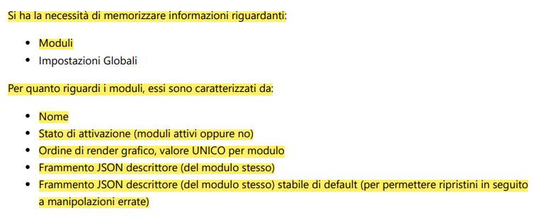
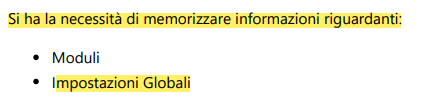
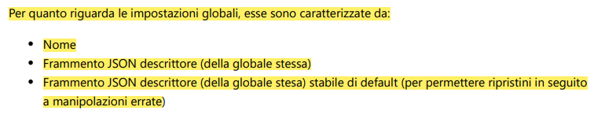

# Database settings - Progettazione Concettuale

## Studio

[Studio](../Studio.md)

---
---
---

## Entità

### module

> Entità Elementare

| Nome Entità | Descrizione                                       |
| ----------- | ------------------------------------------------- |
| module      | Rappresenta un modulo utilizzato nel MagicMirror. |

| Nome Attributi     | Descrizione                                                                   |
| ------------------ | ----------------------------------------------------------------------------- |
| NomeModulo         | Nome univoco del modulo.                                                      |
| Active             | Stato di attivazione del modulo.                                              |
| RenderIndex        | Ordine di render grafico del modulo.                                          |
| JsonFragment       | Frammento JSON descrittore (di configurazione) del modulo.                    |
| JsonStableFragment | Frammento JSON descrittore (di configurazione) stabile di default del modulo. |

---
---

### global

> Entità Elementare

| Nome Entità | Descrizione                                           |
| ----------- | ----------------------------------------------------- |
| global      | Rappresenta una impostazione globale del MagicMirror. |

| Nome Attributi     | Descrizione                                                                                  |
| ------------------ | -------------------------------------------------------------------------------------------- |
| NomeGlobale        | Nome univoco dell'impostazione globale.                                                      |
| JsonFragment       | Frammento JSON descrittore (di configurazione) dell'impostazione globale.                    |
| JsonStableFragment | Frammento JSON descrittore (di configurazione) stabile di default dell'impostazione globale. |

---
---
---

## Associazioni

_Nessuna associazione._

---
---
---

## Diagramma ER

MagicMirror-GBM
