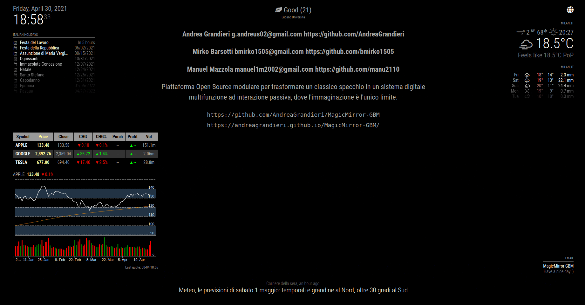

# MagicMirror-GBM

---

---

## Release Log

Qui i dettagli: [Release Log](pages/ReleaseLog.md)

---

## MagicMirror-GBM-OS

Il MagicMirror-GBM è reso funzionale dal suo sistema operativo: `MagicMirror-GBM-OS`.
Qui i dettagli: [MagicMirror-GBM-OS](pages/MagicMirror-GBM-OS.md)

---

## Indice Moduli

Di seguito l'indice dei moduli, con la relativa documentazione:

- [MMM-AirQuality](pages/DocumentazioneModuli/MMM-AirQuality/MMM-AirQuality.md)
- [MMM-DHT-Sensor](pages/DocumentazioneModuli/MMM-DHT-Sensor/MMM-DHT-Sensor.md)
- [newsfeed](pages/DocumentazioneModuli/newsfeed/newsfeed.md)
- [MMM-AVStock](pages/DocumentazioneModuli/MMM-AVStock/MMM-AVStock.md)
- [clock](pages/DocumentazioneModuli/clock/clock.md)
- [weather](pages/DocumentazioneModuli/weather/weather.md)
- [weatherforecast](pages/DocumentazioneModuli/weatherforecast/weatherforecast.md)
- [calendar](pages/DocumentazioneModuli/calendar/calendar.md)
- [MMM-MD](pages/DocumentazioneModuli/MMM-MD/MMM-MD.md)
- [MMM-Screencast](pages/DocumentazioneModuli/MMM-Screencast/MMM-Screencast.md)
- [MMM-Mail](pages/DocumentazioneModuli/MMM-Mail/MMM-Mail.md)
- [MMM-Online-State](pages/DocumentazioneModuli/MMM-Online-State/MMM-Online-State.md)
- [MMM-ip](pages/DocumentazioneModuli/MMM-ip/MMM-ip.md)
- [MMM-PIR-Sensor](pages/DocumentazioneModuli/MMM-PIR-Sensor/MMM-PIR-Sensor.md)

---

## MagicMirror-GBM IP Dashboard

Il MagicMirror-GBM può essere configurato grazie alla sua interfaccia web: `MagicMirror-GBM IP Dashboard`.
Qui i dettagli: [MagicMirror-GBM-IP-Dashboard](pages/MagicMirror-GBM-IP-Dashboard.md)

---

## Documento dei Requisiti

Il Documento dei Requisiti è il documento chiave per formalizzare i fabbisogni del cliente relativamente al sistema da sviluppare, in modo non ambiguo. Cliente, utenti e sviluppatori contribuiscono alla stesura del documento di specifica dei requisiti. Può essere usato come contratto tra cliente e sviluppatori.

- [Archivio Documenti dei Requisiti](pages/ArchivioDocumentiDeiRequisiti.md)

---

## UML Component Diagram

I Diagrammi dei Componenti UML sono usati per la modellazione degli aspetti fisici dei sistemi OO (orientati agli oggetti). Hanno lo scopo di visualizzare, specificare e documentare questi ultimi, oltre a fornire la possibilità di costruire sistemi utilizzando questi diagrammi come punto di partenza, con tecniche di reverse engineering.
I Diagrammi dei Componenti sono essenzialmente Diagrammi delle Classi, che però pongono il focus sui moduli (HW + SW) componenti un sistema per realizzare una visione d'unico dell'implementazione statica di esso stesso.

- [Archivio UML Component Diagram](pages/ArchivioUMLComponentDiagram.md)

---

## Use Case Diagrams

Un Diagramma dei Casi d'Uso (Generico e Specifico) viene utilizzato per riasummere chi (Attori) e come (Sequenze) effettua interazioni con il sistema / i sistemi in questione.

- [Archivio Generic Use Case Diagram](pages/UseCaseDiagrams/ArchivioGenericUseCaseDiagram.md)
- [Archivio Specific Use Case Diagram](pages/UseCaseDiagrams/ArchivioSpecificUseCaseDiagram.md)

---

## BMC

Il BMC (Business Model Canvas) è un modello di gestione strategica utilizzato per sviluppare nuovi modelli di business e documentare quelli esistenti. Offre un grafico visivo con elementi che descrivono la proposta di valore, l'infrastruttura, i clienti e le finanze di un'azienda o di un prodotto, aiutando le aziende ad allineare le proprie attività evidenziando potenziali compromessi.

- [Archivio BMC](pages/ArchivioBMC.md)

---

## Emulazione

Qui i dettagli: [Emulazione](pages/Emulazione.md)

---

## raspotify

Qui i dettagli: [raspotify](pages/raspotify.md)

---

## DB settings

Il Database `settings` è il punto di salvataggio e recupero di tutte le informazioni riguardanti la configurazione
di default e personale dell'utilizzatore.

- [Archivio Analisi DB settings](pages/ProgettazioneDatabase_settings/ProgettazioneDatabase_settings.md)

---

## Schema di Rete

Qui i dettagli: [Schema di Rete](pages/schemaDiRete.md)
