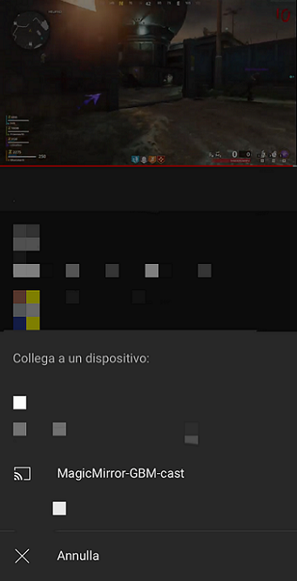
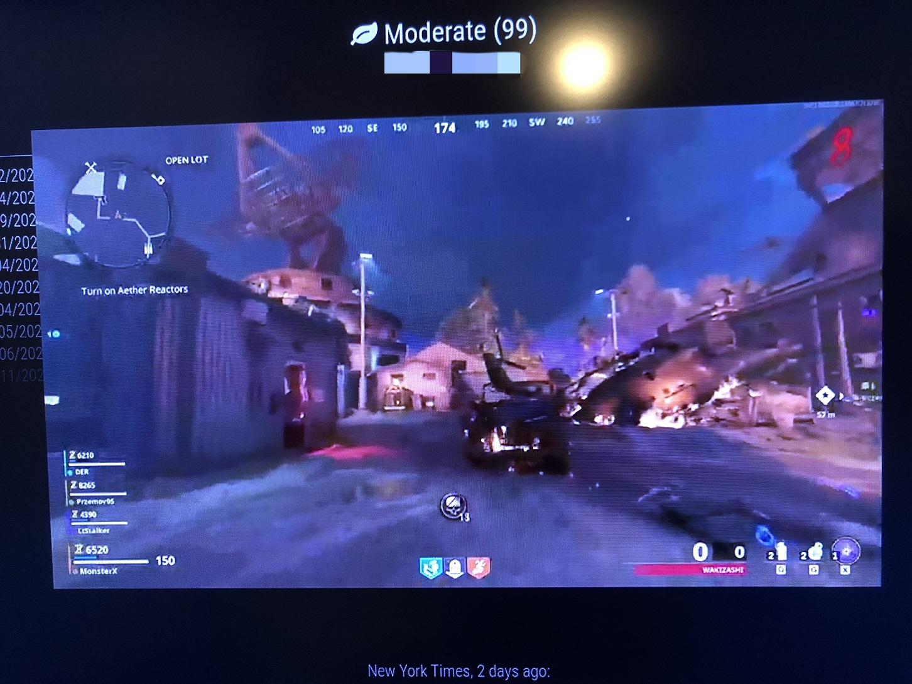

# MMM-Screencast

## tl;dr

Permette di effettuare il cast di contenuti multimediali (video & audio) da
diversi dispositivi smart al MagicMirror.

__E' necessario connettere il dispositivo smart (e.g. Smartphone, Tablet...) dal quale
si invia il cast e il MagicMirror alla stessa rete locale (LAN).__

---

## config.js fragment

```js
{
    module: 'MMM-Screencast',
    position: 'bottom_right', 
    config: {
        position: 'center',
        height: 600,
        width: 1000,
        castName: "MagicMirror-GBM-cast"
    }
}
```

---

## Proprietà (config section)

| Proprietà  | Tipo     | Valori                                                                                                            | Valore Default  | Inderogabilità                            | Descrizione                                                                                                  |
| ---------- | -------- | ----------------------------------------------------------------------------------------------------------------- | --------------- | ----------------------------------------- | ------------------------------------------------------------------------------------------------------------ |
| `position` | `String` | `bottomRight` <br> `bottomCenter` <br> `bottomLeft` <br> `center` <br> `topRight` <br> `topCenter` <br> `topLeft` | `---`           | `REQUIRED`                                | Posizione finestra del riproduttore multimediale (in azione).                                                |
| `x`        | `Number` | Qualsiasi valore in `pixel`                                                                                       | `---`           | `OPTIONAL` (richiesto se specificato `y`) | Offset finestra del riproduttore multimediale dal `LATO SINISTRO` dello schermo _(traslazione orizzontale)_. |
| `y`        | `Number` | Qualsiasi valore in `pixel`                                                                                       | `---`           | `OPTIONAL` (richiesto se specificato `x`) | Offset finestra del riproduttore multimediale dal `LATO SINISTRO` dello schermo _(traslazione verticale)_.   |
| `height`   | `Number` | Qualsiasi valore in `pixel` `> 0`                                                                                 | `---`           | `REQUIRED`                                | Altezza della finestra del riproduttore multimediale.                                                        |
| `width`    | `Number` | Qualsiasi valore in `pixel` `> 0`                                                                                 | `---`           | `REQUIRED`                                | Larghezza della finestra del riproduttore multimediale.                                                      |
| `castName` | `String` | Qualsiasi valore                                                                                                  | `"os.hostname"` | `OPTIONAL`                                | Nome da visualizzare nella lista di dispositivi abilitati al cast.                                           |
| `port`     | `Number` | Qualsiasi valore di porta valido (`1024 < PORT < 65 536`)                                                         | `8569`          | `OPTIONAL`                                | Porta per eseguire il _dialserver_.                                                                          |

---

## Notifiche

Le notifiche sono uno strumento utilizzato dai moduli per comunicare con:

- L'OS del MagicMirror
- Altri moduli
- Attori umani

| Notifica                      | Direzione | Trigger                                                                                                       | Payload _(inline js)_                     | Descrizione |
| ----------------------------- | --------- | ------------------------------------------------------------------------------------------------------------- | ----------------------------------------- | ----------- |
| `MMM-Screencast:START-DIAL`   | `OUT`     | Quando il `DIAL server` entra in fase di esecuzione.                                                          | `{ port: <PORT_USED> }`                   | ---         |
| `MMM-Screencast:LAUNCH-APP`   | `OUT`     | Quando l'app che invia la richiesta di cast entra in fase di inizializzazione.                                | `{ app: <APP_NAME>, state: <APP_STATE> }` | ---         |
| `MMM-Screencast:RUN-APP`      | `OUT`     | Quando l'app che invia la richiesta di cast entra in fase di esecuzione.                                      | `{ app: <APP_NAME>, state: <APP_STATE> }` | ---         |
| `MMM-Screencast:STOP-APP`     | `OUT`     | Quando l'app che invia la richiesta di cast termina la sua esecuzione.                                        | `{ app: <APP_NAME>, state: <APP_STATE> }` | ---         |
| `MMM-Screencast:CONFIG-ERROR` | `OUT`     | Quando è stato rilevato un errore di configurazione del modulo.                                               | `{ message: <MESSAGE_ABOUT_ERROR>}`       | ---         |
| `MMM-Screencast:CLOSE`        | `IN`      | Chiede l'arresto dell'esecuzione dell'app che invia la richiesta di cast (se si trova in fase di esecuzione). | `---`                                     | ---         |

---

## Screenshots

Schermata del dispositivo smart (e.g. Smartphone, Tablet...):



Schermata del MagicMirror:



---

## Servizi Compatibili

- Youtube
