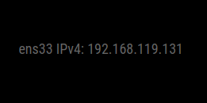

# MMM-ip

## tl;dr

Visualizza gli indirizzi IP __locali__ delle interfacce di rete attive nel __Raspberry Pi__.

---

## config.js fragment

```js
{
    module: 'MMM-ip',
    position: 'bottom_right',
    config: {
        fontSize: 18,
        families: [
            "IPv4"
        ],
        types: [
            "wlan0"
        ]
    }
}
```

---

## Proprietà (config section)

| Proprietà  | Tipo                | Valori                                                                                          | Valore Default | Inderogabilità | Descrizione                                                                                 |
| ---------- | ------------------- | ----------------------------------------------------------------------------------------------- | -------------- | -------------- | ------------------------------------------------------------------------------------------- |
| `fontSize` | `Integer`           | Qualsiasi valore `> 0`. Unità di misura: `pixel`.                                               | `9`            | `OPTIONAL`     | Dimensione in pixel del font per la visualizzazione degli elementi renderizzati dal modulo. |
| `families` | `Array` -> `String` | `"IPv4"`: Visualizza indirizzi IPv4. <br> `IPv6`: Visualizza indirizzi IPv6 .                   | `---`          | `REQUIRED`     | Tipologia / Tipologie di indirizzi IP da visualizzare.                                      |
| `types`    | `Array` -> `String` | Nome interfaccia / interfacce di rete da monitorare. _Guarda sotto per ulteriori informazioni_. | `---`          | `REQUIRED`     | Interfaccia / Interfacce di rete da monitorare.                                             |

---

## Notifiche

Le notifiche sono uno strumento utilizzato dai moduli per comunicare con:

- L'OS del MagicMirror
- Altri moduli
- Attori umani

_Niente da segnalare._

---

## Screenshots

Schermata del modulo in esecuzione correttamente:

_In questo esempio `ens33` è il nome dell'interfaccia di rete._



---

## Interfaccia di Rete

Solitamente le interfacce di rete di default per un __Raspberry Pi__ in
_situazione normale_ (cioè senza modifiche alle impostazioni di default dell'OS)
sono le seguenti:

- Ethernet: `eth0`
- WIFI: `wlan0`

Questi sono i comandi per ottenere informazioni sulle interfacce di rete del
proprio __Raspberry Pi__. Essi vanno eseguiti nell'applicazione `Terminal`:

```shell
netstat -i
```

Output:

Il nostro interesse è sulla colonna `Iface`, che riporta i nomi delle interfacce.

```shell
Kernel Interface table
Iface      MTU    RX-OK RX-ERR RX-DRP RX-OVR    TX-OK TX-ERR TX-DRP TX-OVR Flg
eth0      1500        0      0      0 0             0      0      0      0 BMU
lo       65536        0      0      0 0             0      0      0      0 LRU
wlan0     1500      228      0      0 0            81      0      0      0 BMRU
```

> L'interfaccia `lo` sarà sempre presente. Essa rappresenta l'interfaccia di _loopback_.
> Per quanto riguarda il seguente modulo, essa __NON__ deve essere presa in considerazione.

Link per riferimenti utili: [https://www.cyberciti.biz/faq/linux-list-network-interfaces-names-command/](https://www.cyberciti.biz/faq/linux-list-network-interfaces-names-command/)
