# calendar

## tl;dr

Visualizza eventi da uno o più calendari.

---

## config.js fragment

```js
{
    module: "calendar",
    position: "top_left",
    config: {
        showLocation: true,
        wrapEvents: true,
        wrapLocationEvents: true,
        fetchInterval: 1000,
        displayRepeatingCountTitle: false,
        timeFormat: "relative",
        getRelative: 1,
        urgency: 0,
        calendars: [
            {
                url: "YOUR_CALENDAR_ICAL_URL",
                color: "#00E0E0",
                name: "YOUR_CALENDAR_NAME"
            }
        ]
    }
}
```

---

## Proprietà (config section)

| Proprietà                    | Tipo              | Valori                                                                                                                                                                   | Valore Default | Inderogabilità | Descrizione                                                                                                                   |
| ---------------------------- | ----------------- | ------------------------------------------------------------------------------------------------------------------------------------------------------------------------ | -------------- | -------------- | ----------------------------------------------------------------------------------------------------------------------------- |
| `showLocation`               | `Boolean`         | `true`: Visualizzazione della zona di svolgimento dell'evento attiva. <br> `false`: Visualizzazione della zona di svolgimento dell'evento disattiva.                     | `false`        | `OPTIONAL`     | Attiva la visualizzazione della zona di svolgimento dell'evento attiva.                                                       |
| `maxTitleLength`             | `Number`          | `10 <= x <= 50`                                                                                                                                                          | `25`           | `OPTIONAL`     | Valore limite oltre il quale entra in azione `wrapEvents`, se previsto.                                                       |
| `wrapEvents`                 | `Boolean`         | `true`: Multilinea per nomi degli eventi attiva. <br> `false`: Multilinea per nomi degli eventi disattiva.                                                               | `false`        | `OPTIONAL`     | Attiva il wrapping multilinea per nomi degli eventi.                                                                          |
| `maxLocationTitleLength`     | `Number`          | `10 <= x <= 50`                                                                                                                                                          | `25`           | `OPTIONAL`     | Valore limite oltre il quale entra in azione `wrapLocationEvents`, se previsto.                                               |
| `wrapLocationEvents`         | `Boolean`         | `true`: Multilinea per nomi delle zone di svolgimento degli eventi attiva. <br> `false`: Multilinea per nomi delle zone di svolgimento degli eventi disattiva.           | `false`        | `OPTIONAL`     | Attiva il wrapping multilinea per nomi delle zone di svolgimento degli eventi.                                                |
| `fetchInterval`              | `Number`          | `1000 <= x <= 86400000` millisecondi.                                                                                                                                    | `300000`       | `OPTIONAL`     | Periodo di fetch per scaricare aggiornamenti dei contenuti del calendario.                                                    |
| `fade`                       | `Boolean`         | `true`: Oscuramento sfumato degli eventi _sempre più_ futuri attivo. <br> `false`: Oscuramento sfumato degli eventi _sempre più_ futuri disattivo.                       | `true`         | `OPTIONAL`     | Attiva l'oscuramento sfumato degli eventi _sempre più_ futuri.                                                                |
| `displayRepeatingCountTitle` | `Boolean`         | `true`: Visualizzazione contatore autoincrementante per eventi ripetuti attiva. <br> `false`: Visualizzazione contatore autoincrementante per eventi ripetuti disattiva. | `false`        | `OPTIONAL`     | Attiva la visualizzazione contatore autoincrementante per eventi ripetuti.                                                    |
| `dateFormat`                 | `String`          | Valori possibili elencati qui: [https://momentjs.com/docs/#/parsing/string-format/](https://momentjs.com/docs/#/parsing/string-format/).                                 | `"MMM Do"`     | `OPTIONAL`     | Formato di visualizzazione della data di inizio di un evento __(valido solo se `timeFormat` è `absolute`)__.                  |
| `dateEndFormat`              | `String`          | Valori possibili elencati qui: [https://momentjs.com/docs/#/parsing/string-format/](https://momentjs.com/docs/#/parsing/string-format/).                                 | `"HH:mm"`      | `OPTIONAL`     | Formato di visualizzazione dell'ora di fine di un evento.                                                                     |
| `fullDayEventDateFormat`     | `String`          | Valori possibili elencati qui: [https://momentjs.com/docs/#/parsing/string-format/](https://momentjs.com/docs/#/parsing/string-format/).                                 | `"MMM Do"`     | `OPTIONAL`     | Formato di visualizzazione della data di inizio di un evento a tutta giornata __(valido solo se `timeFormat` è `absolute`)__. |
| `timeFormat`                 | `String`          | `"absolute"`: _Vedi sezione dedicata sotto_. <br> `"relative"`: _Vedi sezione dedicata sotto_.                                                                           | `"relative"`   | `OPTIONAL`     | Formato di visualizzazione del _tempo_ (__tutte__ le date associate all'evento) degli eventi.                                 |
| `getRelative`                | `Number`          | `0 <= x <= 48` ore. Un valore di _0_ ore disabilita questa funzionalità.                                                                                                 | `6`            | `OPTIONAL`     | Quante ore all'accadere di un evento devono mancare per visualizzare il _tempo_ di quell'evento in formato `"relative"`.      |
| `urgency`                    | `Number`          | `x >= 0`: giorni. Un valore di _0_ giorni disabilita questa funzionalità.                                                                                                | `7`            | `OPTIONAL`     | Quanti giorni all'accadere di un evento devono mancare per visualizzare il _tempo_ di quell'evento in formato `"relative"`.   |
| `broadcastEvents`            | `Boolean`         | `true`: Broadcast notifiche per eventi del calendario attivo. <br> `false`: Broadcast notifiche per eventi del calendario disattivo.                                     | `true`         | `OPTIONAL`     | Attiva il broadcast notifiche per eventi del calendario _(guarda la sezione Notifiche per maggiori dettagli)_.                |
| `calendars`                  | `Array -> Object` | _Regole di compilazione riportate sotto_.                                                                                                                                | `---`          | `REQUIRED`     | Lista di calendari dai quali prelevare gli eventi.                                                                            |

`calendars`:

| Proprietà | Tipo     | Valori                                                                                                      | Valore Default | Inderogabilità | Descrizione                                                                                                                                 |
| --------- | -------- | ----------------------------------------------------------------------------------------------------------- | -------------- | -------------- | ------------------------------------------------------------------------------------------------------------------------------------------- |
| `url`     | `String` | _Regole per ottenere il valore riportate sotto_.                                                            | `---`          | `REQUIRED`     | URL ___.ical___ che identifica il calendario dal quale prelevare gli eventi. Può essere ad accesso __libero__ o __previa autenticazione__.  |
| `color`   | `String` | Tonalità di colore espressa in valore esadecimale [https://htmlcolorcodes.com](https://htmlcolorcodes.com). | `---`          | `OPTIONAL`     | Tonalità di colore che identifica il calendario corrente.                                                                                   |
| `name`    | `String` | Qualsiasi stringa.                                                                                          | `---`          | `OPTIONAL`     | Nome per identificare il calendario corrente.                                                                                               |
| `auth`    | `Object` | _Regole di compilazione riportate sotto_.                                                                   | `---`          | `OPTIONAL`     | Opzioni di autenticazione per utilizzare il calendario. __Necessario solo se il tipo di accesso al calendario è: "previa autenticazione"__. |

`auth`:

| Proprietà | Tipo     | Valori                                                                                                                                                                                                                                                                                                                                                                                                                                                                                                                    | Valore Default | Inderogabilità | Descrizione                         |
| --------- | -------- | ------------------------------------------------------------------------------------------------------------------------------------------------------------------------------------------------------------------------------------------------------------------------------------------------------------------------------------------------------------------------------------------------------------------------------------------------------------------------------------------------------------------------- | -------------- | -------------- | ----------------------------------- |
| `user`    | `String` | Username.                                                                                                                                                                                                                                                                                                                                                                                                                                                                                                                 | `---`          | `REQUIRED`     | Username per l'autenticazione HTTP. |
| `pass`    | `String` | Password.                                                                                                                                                                                                                                                                                                                                                                                                                                                                                                                 | `---`          | `REQUIRED`     | Password per l'autenticazione HTTP. |
| `method`  | `String` | `"basic"`: Dettagli tecnici qui: [https://it.wikipedia.org/wiki/Basic_access_authentication](https://it.wikipedia.org/wiki/Basic_access_authentication) <br> `"digest"`: Dettagli tecnici qui: [https://it.wikipedia.org/wiki/Digest_access_authentication](https://it.wikipedia.org/wiki/Digest_access_authentication) <br> `"bearer"`: Dettagli tecnici qui: [https://swagger.io/docs/specification/authentication/bearer-authentication/](https://swagger.io/docs/specification/authentication/bearer-authentication/) | `"basic"`      | `OPTIONAL`     | Metodo per l'autenticazione HTTP.   |

---

## Notifiche

Le notifiche sono uno strumento utilizzato dai moduli per comunicare con:

- L'OS del MagicMirror
- Altri moduli
- Attori umani

| Notifica          | Direzione | Trigger                                                                            | Payload _(inline js)_                                                                                                                                                                   | Descrizione                                                                                                                                                     |
| ----------------- | --------- | ---------------------------------------------------------------------------------- | --------------------------------------------------------------------------------------------------------------------------------------------------------------------------------------- | --------------------------------------------------------------------------------------------------------------------------------------------------------------- |
| `CALENDAR_EVENTS` | `OUT`     | La notifica è in funzione se il valore della proprietà `broadcastEvents` è `true`. | `[{title: "TITOLO_EVENTO", startDate: "DATA_INIZIO_EVENTO", endDate: "DATA_FINE_EVENTO", fullDayEvent: "EVENTO_TUTTA GIORNATA?", location: "LOCATION_EVENTO", geo: "INFO_GEO_EVENTO"}]` | Le informazioni relative agli eventi presenti nel calendario interessato vengono trasmesse agli altri moduli, per comunicare con quest'ultimi (se compatibili). |

---

## Screenshots

Scheramata del modulo in funzione in modo corretto in una qualsiasi configurazione _(non specificata)_:

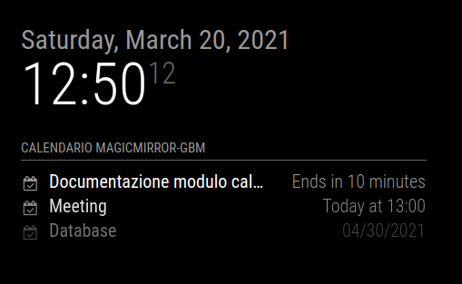

---

## ICAL

Il _Internet Calendaring and Scheduling Core Object Specification (iCal)_ è un formato multimediale che permette
lo scambio di informazioni riguardanti schedulazione e gestione del calendario.
Esempi di informazioni interessate sono:

- Eventi
- TODOs
- Stato di Libero / occupato

Questi file hanno estensione: `.ical`.
Questo formato è conforme allo standard `RFC 5545` per lo scambio di dati relativi a calendari.

Le modalità per ottenere un __RIFERIMENTO ICAL__ per il proprio calendario possono differire in base al
provider utilizzato fornitore del calendario. Qui di seguito vengono riportati gli step per `Google Calendar`,
il provider più utilizzato.

_Una ricerca su Internet può fornire indicazioni e chiarire dubbi per qualsiasi provider._

### Google Calendar

1. Aprire Google Calendar

E' possibile anche usare il seguente link: [https://calendar.google.com/calendar](https://calendar.google.com/calendar)


1. Identificare il calendario d'interesse


3. Aprire le impostazioni relative a quel calendario


4. Nelle impostazioni generiche del calendario, individuare la sezione: `Indirizzo segreto in formato iCal`


5. Visualizzare e copiare negli appunti l'indirizzo


6. Dall'IP Dashboard, recarsi nella configurazione del modulo `calendar`


7. Incollare l'indirizzo nell'apposita sezione


8. Salvare le modifiche


9. Compilare lo stato del Database, per rendere effettive le modifiche


---

## timeFormat

Di seguito sono riportati vari esempi delle possibili configurazioni.
Essi, insieme ad un po' di testing individuale possono aiutare a capire il funzionamento
delle proprietà `timeFormat` + `getRelative` + `urgency`:

### Considerazioni

Si verificano le seguenti associazioni:

- `getRelative` considerato con `timeFormat: "relative"`
- `urgency` considerato con `timeFormat: "absolute"`

`getRelative`, quando entra in azione, trasforma:

- Riferimento di tempo del tipo: `Today at 14:00` in `(starts) In an hour`

`urgency`, quando entra in azione, trasforma:

- Riferimento di tempo del tipo: `Apr 30th` in `(starts) In a month`

### rel1

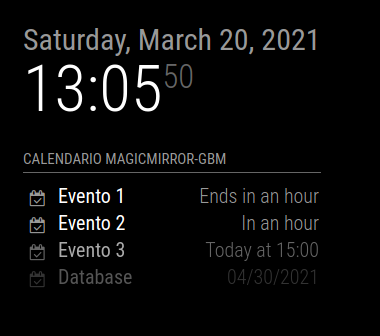
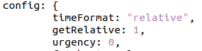

### rel2

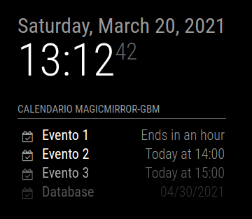
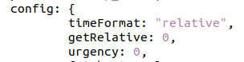

### rel3

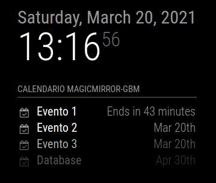
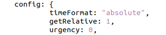

### rel4

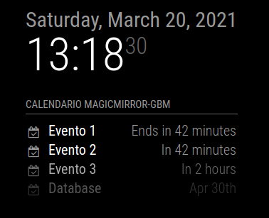
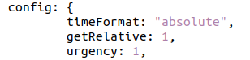

### rel5

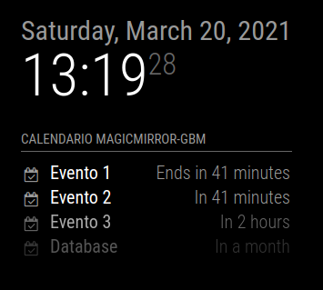
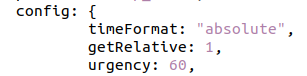

### rel6

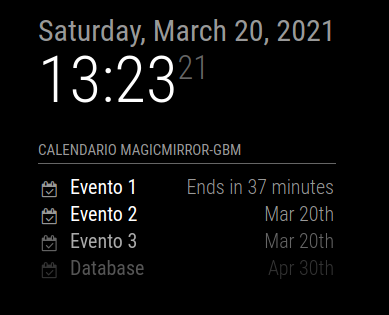
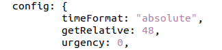

### rel7

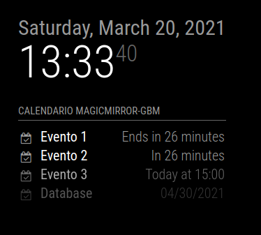
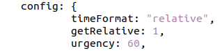

### timeFormat puro

`timeFormat: "absolute"` senza alcun modificatore (senza `urgency`):

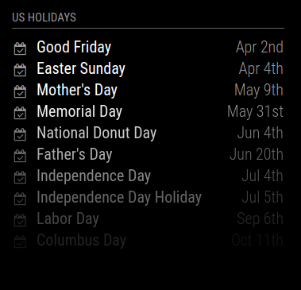

`timeFormat: "relative"` senza alcun modificatore (senza `getRelative`):

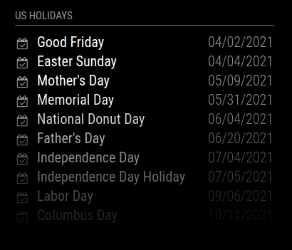
