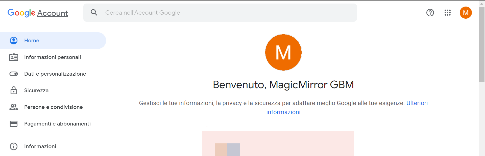
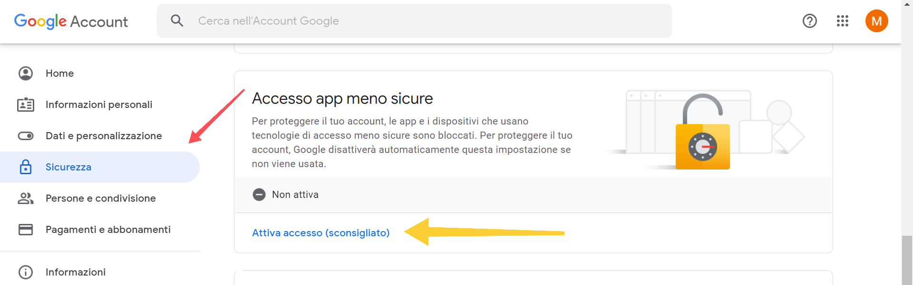

# MMM-Mail

## tl;dr

Il seguente modulo permette di consultare in lettura la tua casella di posta elettronica.

---

## Config JSON Fragment

```json
{
	"module": "MMM-Mail",
	"position": "bottom_left",
	"header": "Email",
	"config": {
		"user": "YOUR_EMAIL_ADDRESS_HERE",
		"pass": "YOUR_EMAIL_PASSWORD_HERE",
		"host": "imap.gmail.com",
		"port": 993,
		"numberOfEmails": 5,
		"fade": true,
		"subjectlength": 50
	}
}
```

---

## Proprietà (Config Section)

| Proprietà        | Tipo      | Valori                                                                                                               | Valore Default | Inderogabilità | Descrizione                                                      |
| ---------------- | --------- | -------------------------------------------------------------------------------------------------------------------- | -------------- | -------------- | ---------------------------------------------------------------- |
| `user`           | `String`  | Indirizzo email casella postale.                                                                                     | `---`          | `REQUIRED`     | Indirizzo email di cui si vogliono vedere le ultime N mail.      |
| `pass`           | `String`  | Password della casella postale.                                                                                      | `---`          | `REQUIRED`     | Password della casella postale.                                  |
| `host`           | `String`  | Nome host IMAP. _(vedi sotto per ulteriori dettagli)_                                                                | `---`          | `REQUIRED`     | Nome host IMAP.                                                  |
| `port`           | `Number`  | Porta. _(vedi sotto per ulteriori dettagli)_                                                                         | `---`          | `REQUIRED`     | Numero della porta che l'host IMAP utilizza.                     |
| `numberOfEmails` | `Number`  | Qualsiasi valore `> 0`.                                                                                              | `5`            | `OPTIONAL`     | Numero di mail da visualizzare.                                  |
| `fade`           | `Boolean` | `true`: Effetto dissolvenza mail più vecchie attivato <br> `false`: Effetto dissolvenza mail più vecchie disattivato | `true`         | `OPTIONAL`     | Attiva / Disattiva l'effetto dissolvenza delle mail più vecchie. |
| `subjectlength`  | `Number`  | Qualsiasi valore `> 0`.                                                                                              | `---`          | `OPTIONAL`     | Lunchezza massima per la visualizzazione di una mail.            |

---

## Screenshots

Questa è la visualizzazione del modulo in situazione di funzionamento corretto:


---

## Host IMAP

In base al provider di posta elettronica utilizzato, le impostazioni qui di seguito elencate possono
variare. __Attenersi ai valori qui riportati per garantire il corretto funzionamento del modulo.__
Se il provider da te cercato non è riportato nell'elenco, è facilmente reperibile dal web _(con una
ricerca del tipo: `{nome_provider} imap settings`)_:

> GMAIL

| Proprietà | Valore             |
| --------- | ------------------ |
| `host`    | `"imap.gmail.com"` |
| `port`    | `993`              |

> MICROSOFT 365
> OUTLOOK
> HOTMAIL
> LIVE

| Proprietà | Valore                    |
| --------- | ------------------------- |
| `host`    | `"outlook.office365.com"` |
| `port`    | `993`                     |

> YAHOO

| Proprietà | Valore                  |
| --------- | ----------------------- |
| `host`    | `"imap.mail.yahoo.com"` |
| `port`    | `993`                   |

> LIBERO

| Proprietà | Valore                 |
| --------- | ---------------------- |
| `host`    | `"imapmail.libero.it"` |
| `port`    | `993`                  |

> ICLOUD

| Proprietà | Valore               |
| --------- | -------------------- |
| `host`    | `"imap.mail.me.com"` |
| `port`    | `993`                |

---

## Accesso Low Level Security

Il seguente modulo, a causa di svariate limitazioni e complicazioni qui omesse per semplicità,
__NON SUPPORTA l'autenticazione sicura OAUTH o OAUTH2__.
Come diretta conseguenza, esso viene etichettato dai provider di posta elettronica
come `Less secure app` (italiano: `App meno sicura`).

> Dunque, per garantire il corretto funzionalmento del modulo, sarà necessario consentire
> l'accesso ad `App meno sicure` all'account email.

_Generalizzare questa procedura è complicato dato l'elevato numero di provider di posta
elettronica. E' facilmente possibile trovare informazioni sul web._ Riportiamo qui di seguito la procedura da effettuare con `GMAIL`, uno dei provider
più utilizzati:

1. Recarsi nella pagina di configurazione del proprio account Google:

	[https://myaccount.google.com/](https://myaccount.google.com/)

	

2. Recarsi nella tab `Sicurezza` e selezionare / cliccare `Attiva accesso (sconsigliato)` nella opzione `Accesso app meno sicure`:

	

3. Attivare l'opzione `Consenti app meno sicure`:

	
