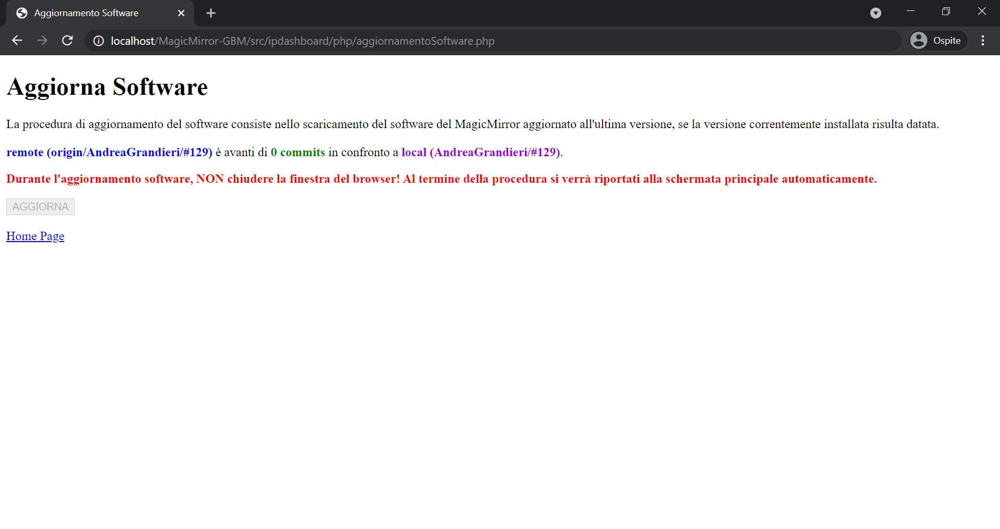

# MagicMirror-GBM IP Dashboard

Il MagicMirror-GBM può essere configurato grazie alla sua interfaccia web: `MagicMirror-GBM IP Dashboard`.
Essa mette a disposizione diversi strumenti per configurare diversi aspetti del MagicMirror-GBM.
Qui riportati e descritti:

> index.php

Home Page. Da qui puoi accedere le diverse funzionalità dell'interfaccia.

---

> moduliSelector.php

Lista dei moduli presenti nel Database del MagicMirror-GBM.
Da qui puoi:

- Attivare / Disattivare modulo
- Cambiare ordine di render grafico del modulo
- Accedere all'embedded editor per modificare il frammento di configurazione del modulo

---

> moduloSettings.php

Embedded editor JSON. Qui puoi modificare il frammento JSON di configurazione del modulo selezionato. __E' raccomandato seguire le indicazioni riportate nei documenti dedicati [https://andreagrandieri.github.io/MagicMirror-GBM/#indice-moduli](https://andreagrandieri.github.io/MagicMirror-GBM/#indice-moduli)__

---

> WIFIConfigurator.php

Da qui puoi modificare le impostazioni relative alla configurazione della connettività WIFI (alla rete) per il MagicMirror-GBM. _Probabilmente ti troverai qui durante la fase di prime._

---

> AudioConfigurator.php

Da qui puoi modificare le impostazioni relative alla configurazione dei dispositivi di output audio per il MagicMirror-GBM.

---

> globalsSelector.php

Lista delle globali presenti nel Database del MagicMirror-GBM.
Da qui puoi:

- Accedere all'embedded editor per modificare il frammento di configurazione della globale

---

> aggiornamentoSoftware.php

Da qui puoi aggiornare il software del MagicMirror-GBM.

---

> doReboot.php

Riavvia il MagicMirror-GBM.

---

> ripristinaDatabase.php

Da qui puoi ripristinare il Database interno del MagicMirror-GBM ad uno stato stabile sicuramente funzionale e corretto.

---

> compila.php

Compila lo stato del Database, rendendo effettive le modifiche effettuate _(con le schermate precedenti)_.

