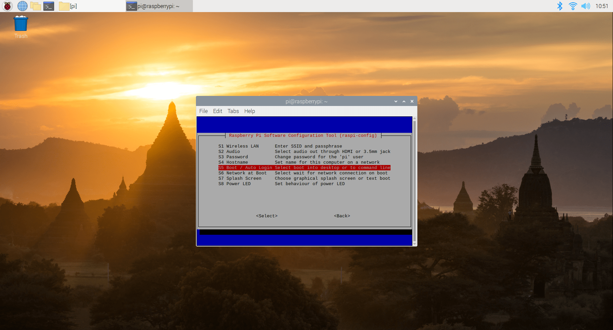
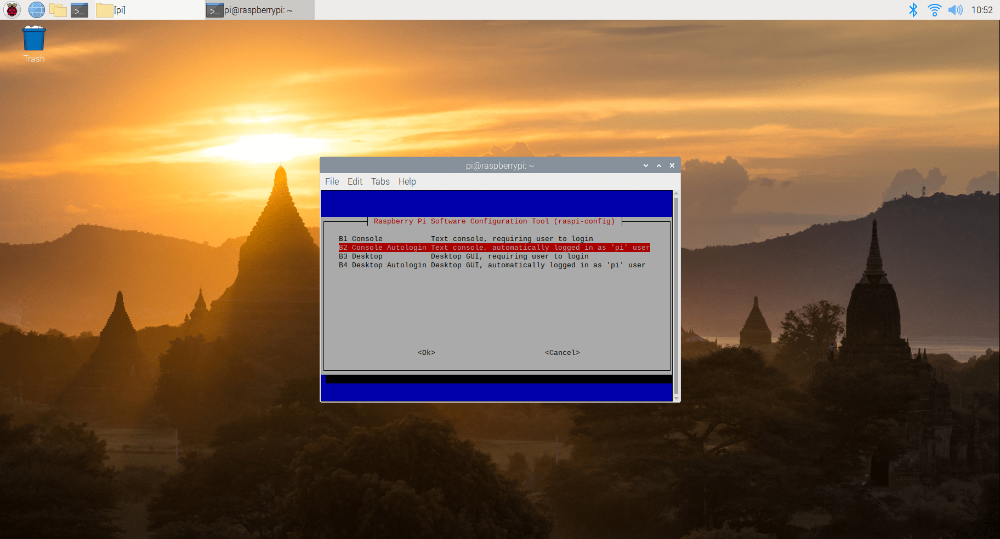
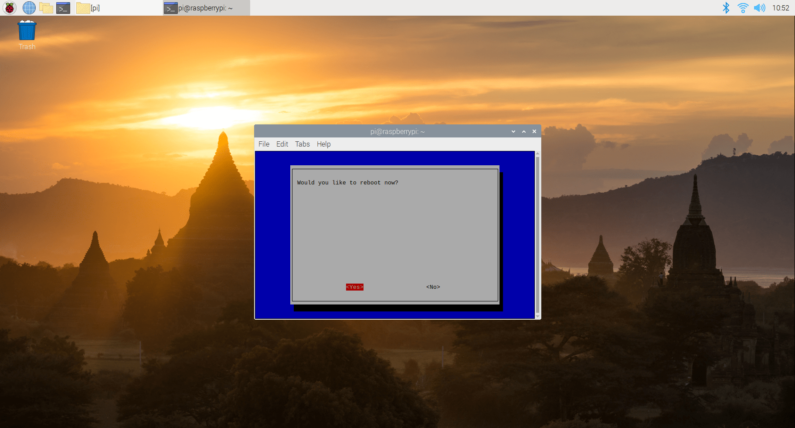

# MagicMirror-GBM-OS

Il MagicMirror-GBM è reso funzionale dal suo sistema operativo: `MagicMirror-GBM-OS`.

Download: _QUI BOTTONE / LINK DOWNLOAD BINARIO_

---

## Specifiche

Ecco riportate le principali caratteristiche e requisiti essenziali:

- Distribuzione: `Raspberry Pi OS (32-bit)`
- Raspberry Pi: `3 o superiore`
- __nodejs: `v10.24.0`__
- __npm: `v5.8.0`__
- Storage Memory: `minimo (rischioso) 8GB; minimo consigliato: 16GB`
- RAM: `minimo 1GB`
- Username: `MagicMirror-GBM-User`
- Password: `magicmirrorgbm`
- Internet configurations: _none_

---

## Costruzione

Di seguito riportati i passaggi per costruire il `MagicMirror-GBM-OS` partendo da una distribuzione `Raspberry Pi OS Full (32-bit)` grezza.
Parte delle seguenti istruzioni sono compatibili per costruire la `MagicMirror-GBM-Emulation-VM`. Esse sono indicate con: ___(+VM)___:

1. __SOLO__ ___(+VM)___: Installare tools vmware:

    ```shell
    sudo apt install open-vm-tools-desktop open-vm-tools
    ```

2. Disattivare spegnimento automatico schermo Raspberry:

    ```shell
    cd \

    # Accesso al file "autostart"
    sudo nano /etc/xdg/lxsession/LXDE-pi/autostart
    ```

    Appendere (in coda) al contenuto del file:

    ```txt
    @xset s off
    @xset -dpms
    ```

3. Installare `nodejs` ___(+VM)___:

    ```shell
    sudo apt install nodejs
    ```

4. Installare `npm` ___(+VM)___:

    ```shell
    sudo apt install npm
    ```

5. Installare `npm-recursive-install` ___(+VM)___:

    ```shell
    sudo npm i -g recursive-install
    ```

6. Installare `bcm2835`:

    ```shell
    wget http://www.airspayce.com/mikem/bcm2835/bcm2835-1.52.tar.gz
    tar zxvf bcm2835-1.52.tar.gz
    cd bcm2835-1.52
    ./configure
    make
    sudo make check
    sudo make install
    cd \
    ```

7. Installare `raspotify`:

    ```shell
    sudo curl -sL https://dtcooper.github.io/raspotify/install.sh | sh
    ```

8. __SOLO__ ___(+VM)___: Installare `git`:

    ```shell
    sudo apt install git
    ```

9. Clonare repo `AndreaGrandieri/MagicMirror-GBM` nella dir `~` ___(+VM)___:

    ```shell
    git clone https://www.github.com/AndreaGrandieri/MagicMirror-GBM
    ```

10. Installare `electron` ___(+VM)___:

    ```shell
    cd MagicMirror-GBM/src/

    npm install electron --save-dev
    cd \
    ```

11. Installazione LAMP (Linux, Apache, MySQL, PHP) ___(+VM)___:

    ```shell
    sudo apt install apache2
    sudo apt install mariadb-server
    sudo mysql_secure_installation
    ```

    mysql_secure_installation:

    ```txt
    Enter current password for root (enter for none): gbm
    Change the root password?: n
    Remove anonymous users: n
    Disallow root login remotely: n
    Remove test database and access to it: y
    Reload privilegies table now: y
    ```

    ```shell
    sudo apt install php libapache2-mod-php php-mysql
    ```

    Modifica della root di serving per Apache e rilascio consensi

    ```shell
    cd /etc/apache2/sites-available

    # Accesso al file "000-default.conf"
    sudo nano 000-default.conf
    ```

    Modificare l'opzione `DocumentRoot` nel file:

    ```conf
    DocumentRoot /home/pi/MagicMirror-GBM/src/ipdashboard
    ```

    Rilascio consensi:

    ```shell
    cd \
    cd /etc/apache2

    # Accesso al file "apache2.conf"
    sudo nano apache2.conf
    ```

    Modificare l'opzione `<Directory /></Directory>` nel file (dovrebbe trovarsi alla riga ___153___):

    ```conf
    <Directory />
        Options Indexes FollowSymLinks Includes ExecCGI
        AllowOverride All
        Require all granted
    </Directory>
    ```

    Installazione di sqlite:

    ```shell
    cd \
    sudo apt-get install php-sqlite3
    ```

    Riavviare il servizio `apache2`:

    ```shell
    sudo service apache2 restart
    ```

12. Modifica dei `sudoers`, in modo tale da permettere l'interfaccia IP l'esecuzione di alcuni comandi che richiedono privilegi di admin:

    ```shell
    # Accesso al file: "sudoers"
    sudo visudo
    ```

    Appendere (in coda) al contenuto del file:

    ```txt
    www-data ALL = NOPASSWD: /sbin/reboot, /sbin/halt
    ```

13. Fornisco permessi di scrittura file protetti all'interfaccia IP:

    ```shell
    sudo chown -R www-data:www-data /etc/default/raspotify
    sudo chmod -R g+w /etc/default/raspotify

    sudo chown -R www-data:www-data /etc/pulse/default.pa
    sudo chmod -R g+w /etc/pulse/default.pa

    sudo chown -R www-data:www-data /etc/wpa_supplicant/wpa_supplicant.conf
    sudo chmod -R g+w /etc/wpa_supplicant/wpa_supplicant.conf

    sudo chown -R www-data:www-data /home/pi/MagicMirror-GBM/src/ipdashboard/
    
    sudo chown -R www-data:www-data /home/pi/MagicMirror-GBM/src/config/config.js
    ```

14. Imposto dispositivo di default per output audio (OS + Raspotify) + configurazione denominazione cast service per Raspotify:
    [https://github.com/AndreaGrandieri/MagicMirror-GBM/issues/76#issuecomment-827711074](https://github.com/AndreaGrandieri/MagicMirror-GBM/issues/76#issuecomment-827711074)
    [https://github.com/AndreaGrandieri/MagicMirror-GBM/issues/228#issuecomment-828311332](https://github.com/AndreaGrandieri/MagicMirror-GBM/issues/228#issuecomment-828311332)

    ```shell
    # Accesso al file "raspotify" (riferimenti utili: https://github.com/AndreaGrandieri/MagicMirror-GBM/issues/76#issuecomment-827711074)
    sudo nano /etc/default/raspotify
    ```

    Modificare l'opzione `DEVICE_NAME` nel file:

    ```txt
    DEVICE_NAME="MagicMirror-GBM-spotify-cast"
    ```

    Modifica l'opzione `OPTIONS` nel file:

    ```txt
    OPTIONS="--device hw:1"
    ```

    ```shell
    # Accesso al file "default.pa" (riferimenti utili: https://github.com/AndreaGrandieri/MagicMirror-GBM/issues/228#issuecomment-828311332)
    sudo nano /etc/pulse/default.pa
    ```

    Modifica l'opzione `set-default-sink` nel file:

    ```pa
    set-default-sink alsa_output.platform-bcm2835_audio.analog-stereo
    ```

15. Riavviare il Raspberry ___(+VM)___:

    ```shell
    sudo shutdown -r now
    ```

16. Eseguire installazione ricorsiva nella dir `~/MagicMirror-GBM/src` con checkout del branch `main` ___(+VM)___:

    ```shell
    cd MagicMirror-GBM/src/    

    npm-recursive-install
    ```

17. Abilitare la modalità `CLI-ONLY` di Raspberry Pi:

    ```shell
    cd \
    sudo raspi-config
    ```

    Segui i passaggi riportati nelle foto:

    

    

    

    

18. Impostare avvio automatico del servizio:

    ```shell
    sudo nano /etc/xdg/lxsession/LXDE-pi/autostart
    @npm run start --prefix /home/pi/MagicMirror-GBM/src/
    ```
