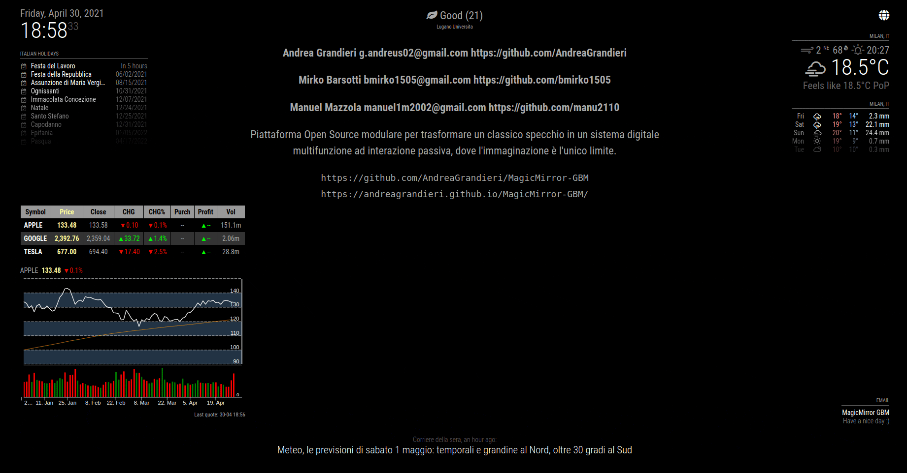

---
# Specifies the "filament" HTML page to be used. The HTML page must be located in the "_layouts" folder.
# (should always be this)
layout: default

# Page title
# If omitted, the page will not be included in the navbar
title: MagicMirror-GBM

# Specifies the order of the current page from the point of view of the navbar
# Can have repetition in the numbers, for parent-child hierarchies
nav_order: 1

# Let exclude the page from the navbar
nav_exclude: false

# If this page represents the parent page of a section that, therefore, has children, specify it in the following way
has_children: true

# If this page represents the child page of a section that, therefore, has ONE parent page, specify it in the following way
# # parent: Namespace

# If this page is a parent page, a Table Of Contents will be automatically generated containing all related child pages. Use the option below to disable this functionality.
has_toc: false

# If a child page has more children, add again
# # has_children: true

# To the children page(s) add
# # parent: NOME_PAGINA_GENITORE
# # grand_parent: NOME_PAGINA_NONNO__GENITORE_DEL_GENITORE

# Let exclude the page from the search engine (client-side)
search_exclude: false

# Notice: codeblocks highlighting supported languages listed here: https://www.fabriziomusacchio.com/blog/2021-08-11-Syntax_Highlighting_in_Jekyll/
---

# MagicMirror-GBM
{: .no_toc }

END
{: .label .label-end-color }

---

<!-- Table of contents -->

  

    Table of contents
  

  {: .text-delta }
1. TOC
{:toc}

---

{: .motto-title } 
> 
tl;dr

>
> Piattaforma Open Source modulare per trasformare un classico specchio in un sistema digitale multifunzione ad interazione passiva, dove l'immaginazione è l'unico limite.

---

<!--  -->

---

---

## MagicMirror-GBM-OS

Il MagicMirror-GBM è reso funzionale dal suo sistema operativo: `MagicMirror-GBM-OS`.
Qui i dettagli: [MagicMirror-GBM-OS](pages/MagicMirror-GBM-OS)

---

## Indice Moduli

Di seguito l'indice dei moduli, con la relativa documentazione:

- [MMM-AirQuality](pages/DocumentazioneModuli/MMM-AirQuality/MMM-AirQuality)
- [MMM-DHT-Sensor](pages/DocumentazioneModuli/MMM-DHT-Sensor/MMM-DHT-Sensor)
- [newsfeed](pages/DocumentazioneModuli/newsfeed/newsfeed)
- [MMM-AVStock](pages/DocumentazioneModuli/MMM-AVStock/MMM-AVStock)
- [clock](pages/DocumentazioneModuli/clock/clock)
- [weather](pages/DocumentazioneModuli/weather/weather)
- [weatherforecast](pages/DocumentazioneModuli/weatherforecast/weatherforecast)
- [calendar](pages/DocumentazioneModuli/calendar/calendar)
- [MMM-MD](pages/DocumentazioneModuli/MMM-MD/MMM-MD)
- [MMM-Screencast](pages/DocumentazioneModuli/MMM-Screencast/MMM-Screencast)
- [MMM-Mail](pages/DocumentazioneModuli/MMM-Mail/MMM-Mail)
- [MMM-Online-State](pages/DocumentazioneModuli/MMM-Online-State/MMM-Online-State)
- [MMM-ip](pages/DocumentazioneModuli/MMM-ip/MMM-ip)
- [MMM-PIR-Sensor](pages/DocumentazioneModuli/MMM-PIR-Sensor/MMM-PIR-Sensor)

---

## MagicMirror-GBM IP Dashboard

Il MagicMirror-GBM può essere configurato grazie alla sua interfaccia web: `MagicMirror-GBM IP Dashboard`.
Qui i dettagli: [MagicMirror-GBM-IP-Dashboard](pages/MagicMirror-GBM-IP-Dashboard)

---

## Documento dei Requisiti

Il Documento dei Requisiti è il documento chiave per formalizzare i fabbisogni del cliente relativamente al sistema da sviluppare, in modo non ambiguo. Cliente, utenti e sviluppatori contribuiscono alla stesura del documento di specifica dei requisiti. Può essere usato come contratto tra cliente e sviluppatori.

- [Archivio Documenti dei Requisiti](pages/ArchivioDocumentiDeiRequisiti)

---

## UML Component Diagram

I Diagrammi dei Componenti UML sono usati per la modellazione degli aspetti fisici dei sistemi OO (orientati agli oggetti). Hanno lo scopo di visualizzare, specificare e documentare questi ultimi, oltre a fornire la possibilità di costruire sistemi utilizzando questi diagrammi come punto di partenza, con tecniche di reverse engineering.
I Diagrammi dei Componenti sono essenzialmente Diagrammi delle Classi, che però pongono il focus sui moduli (HW + SW) componenti un sistema per realizzare una visione d'unico dell'implementazione statica di esso stesso.

- [Archivio UML Component Diagram](pages/ArchivioUMLComponentDiagram)

---

## Use Case Diagrams

Un Diagramma dei Casi d'Uso (Generico e Specifico) viene utilizzato per riasummere chi (Attori) e come (Sequenze) effettua interazioni con il sistema / i sistemi in questione.

- [Archivio Generic Use Case Diagram](pages/UseCaseDiagrams/ArchivioGenericUseCaseDiagram)
- [Archivio Specific Use Case Diagram](pages/UseCaseDiagrams/ArchivioSpecificUseCaseDiagram)

---

## BMC

Il BMC (Business Model Canvas) è un modello di gestione strategica utilizzato per sviluppare nuovi modelli di business e documentare quelli esistenti. Offre un grafico visivo con elementi che descrivono la proposta di valore, l'infrastruttura, i clienti e le finanze di un'azienda o di un prodotto, aiutando le aziende ad allineare le proprie attività evidenziando potenziali compromessi.

- [Archivio BMC](pages/ArchivioBMC)

---

## Emulazione

Qui i dettagli: [Emulazione](pages/Emulazione)

---

## raspotify

Qui i dettagli: [raspotify](pages/raspotify)

---

## DB settings

Il Database `settings` è il punto di salvataggio e recupero di tutte le informazioni riguardanti la configurazione
di default e personale dell'utilizzatore.

- [Archivio Analisi DB settings](pages/ProgettazioneDatabase_settings/ProgettazioneDatabase_settings)

---

## Schema di Rete

Qui i dettagli: [Schema di Rete](pages/schemaDiRete)
