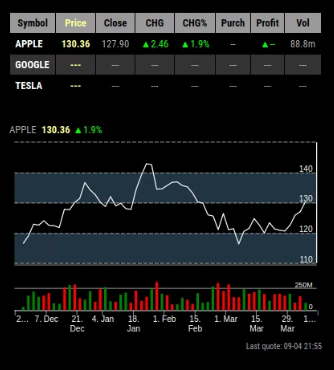
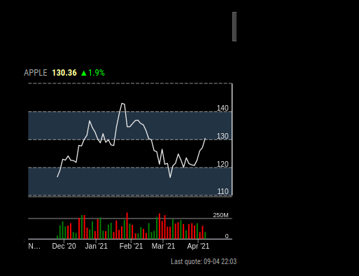
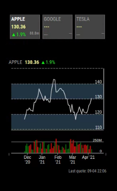
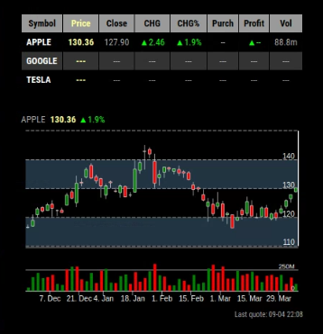
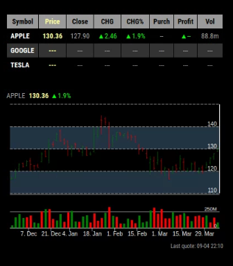
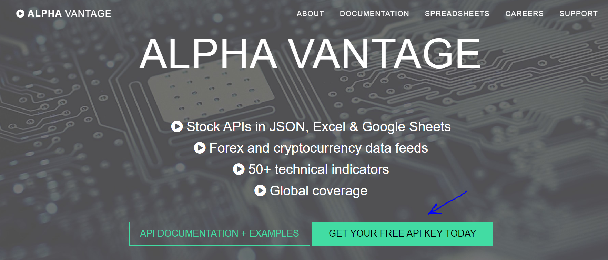
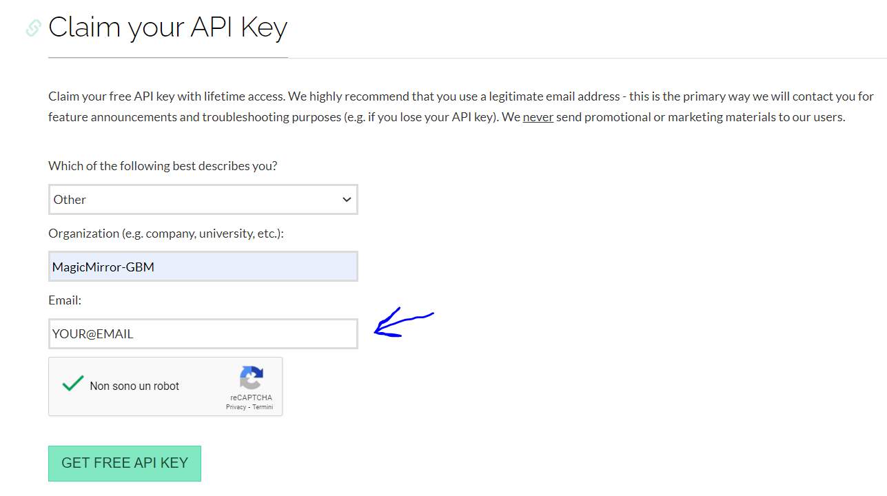
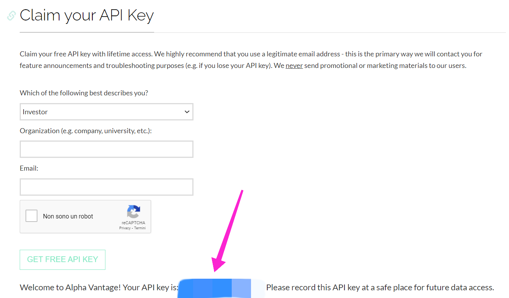

# MMM-AVStock

## tl;dr

Visualizza gli aggiornamenti relativi alle quotazioni in borsa.

---

## Config JSON Fragment

```json
{
    "module": "MMM-AVStock",
    "position": "bottom_left",
    "config": {
        "apiKey": "YOUR_ALPHAVANTAGE_KEY",
        "mode": "table",
        "chartType": "line",
        "symbols": ["AAPL", "GOOGL", "TSLA"],
        "alias": ["APPLE", "GOOGLE", "TESLA"],
        "showChart": true,
        "direction": "column"
    }
}
```

---

## Proprietà (Config Section)

| Proprietà         | Tipo              | Valori                                                                                                                                                                                          | Valore Default              | Inderogabilità | Descrizione                                                                                                                       |
| ----------------- | ----------------- | ----------------------------------------------------------------------------------------------------------------------------------------------------------------------------------------------- | --------------------------- | -------------- | --------------------------------------------------------------------------------------------------------------------------------- |
| `apiKey`          | `String`          | Valore valido API KEY.                                                                                                                                                                          | `---`                       | `REQUIRED`     | La tua API KEY gratuita per l'utilizzo del servizio. _Vedi sotto per maggiori dettagli._                                          |
| `mode`            | `String`          | `"table"` Visualizzazione __table__. <br> `"ticker"` Visualizzazione __ticker__. <br> `"grid"` Visualizzazione __griglia__.                                                                     | `"table"`                   | `OPTIONAL`     | _Vedi sotto_ per confrontare i diversi aspetti di visualizzazione.                                                                |
| `timeFormat`      | `String`          | Qui sono riportati tutti i valori validi: [https://momentjs.com/](https://momentjs.com/).                                                                                                       | `"DD-MM HH:mm"`             | `OPTIONAL`     | Formato di visualizzazione del tempo (Data e / o Ora).                                                                            |
| `symbols`         | `Array -> String` | Qui sono riportati tutti i simboli di mercato validi e aggiornati: [https://stockanalysis.com/stocks/](https://stockanalysis.com/stocks/).                                                      | `["AAPL", "GOOGL", "TSLA"]` | `OPTIONAL`     | Simboli di mercato di cui tenere traccia. __Questa proprietà è parallela alla proprietà `alias`__.                                |
| `alias`           | `Array -> String` | Qualsiasi valore di stringa.                                                                                                                                                                    | `[]`                        | `OPTIONAL`     | Alias per (sostituire) il _vero_ nome dei simboli di mercato. __Questa proprietà è parallela alla proprietà `symbols`__.          |
| `chartType`       | `String`          | `"line"` Visualizzazione __line__ nel grafico. <br> `"candlestick"` Visualizzazione __candlestick__ nel grafico. <br> `"ohlc"` Visualizzazione __OHLC__ nel grafico.                            | `"line"`                    | `OPTIONAL`     | _Vedi sotto_ per confrontare i diversi aspetti di visualizzazione.                                                                |
| `chartLineColor`  | `String`          | Qualsiasi valore HEX (esadecimale) di colore valido [https://htmlcolorcodes.com/](https://htmlcolorcodes.com/).                                                                                 | `"#eee"`                    | `OPTIONAL`     | Colore delle linee del grafico.                                                                                                   |
| `chartLabelColor` | `String`          | Qualsiasi valore HEX (esadecimale) di colore valido [https://htmlcolorcodes.com/](https://htmlcolorcodes.com/).                                                                                 | `"#eee"`                    | `OPTIONAL`     | Colore delle etichette del grafico.                                                                                               |
| `coloredCandles`  | `Boolean`         | `true` Attiva la colorazione delle _barre a candele_ o _barre OHLC_. <br> `false` Disattiva la colorazione delle _barre a candele_ o _barre OHLC_.                                              | `true`                      | `OPTIONAL`     | Attiva la colorazione delle _barre a candele_ o _barre OHLC_ _(la differenza è dettata dalla proprietà `chartType`)_.             |
| `showChart`       | `Boolean`         | `true` Attiva la visualizzazione del grafico. <br> `false` Disattiva la visualizzazione del grafico.                                                                                            | `true`                      | `OPTIONAL`     | Attiva la visualizzazione del grafico.                                                                                            |
| `direction`       | `String`          | `"row"` Visualizzazione tabella dati e grafico sulla stessa linea, spazio permettendo. <br> `"column"` Visualizzazione tabella dati e grafico su linee diverse (grafico sotto la tabella dati). | `"row"`                     | `OPTIONAL`     | Specifica la modalità di impaginazione per tabella dati e grafico. __E' fortemente consigliato NON modificare questa proprietà!__ |

---

## Notifiche

Le notifiche sono uno strumento utilizzato dai moduli per comunicare con:

- L'OS del MagicMirror
- Altri moduli
- Attori umani

_Nulla da segnalare._

---

## Screenshots

Visualizzazione `mode`: `"table"` _(`chartType`: `"line"`)_:
Visualizzazione `chartType`: `"line"` _(`mode`: `"table"`)_:



Visualizzazione `mode`: `"ticker"` _(`chartType`: `"line"`)_:



Visualizzazione `mode`: `"grid"` _(`chartType`: `"line"`)_:



Visualizzazione `chartType`: `"candlestick"` _(`mode`: `"table"`)_:



Visualizzazione `chartType`: `"ohlc"` _(`mode`: `"table"`)_:



---

## ALPHAVANTAGE API KEY

La __ALPHAVANTAGE API KEY__ è una chiave personale per l'utilizzo gratuito (max. 500 richieste al giorno)
del servizio online di Alphavantage per ottenere informazioni riguardanti le
quotazioni in borsa. __Questa chiave è essenziale per il funzionamento del modulo.__
Di seguito le istruzioni per ottenere la propria chiave personale gratuita:

1. Recarsi al sito [https://www.alphavantage.co/](https://www.alphavantage.co/)

2. Cliccare il pulsante riportato nell'immagine



3. Compila il form riportato nell'immagine __con gli stessi dati__, eccetto
   per il campo `Email`; qui, al posto di `YOUR@EMAIL`, __inserisci la tua _(vera)_ email__.



4. Una volta effettuata la registrazione, la chiave personale verrà visualizzata
   __per un periodo di tempo limitato__ nella zona indicata dalla freccia
   nell'immagine. __Copiare e conservare in un posto sicuro questa chiave.__
   __Essa rappresenta il valore da utilizzare per compilare la proprietà `apiKey`__.


