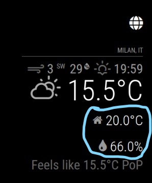
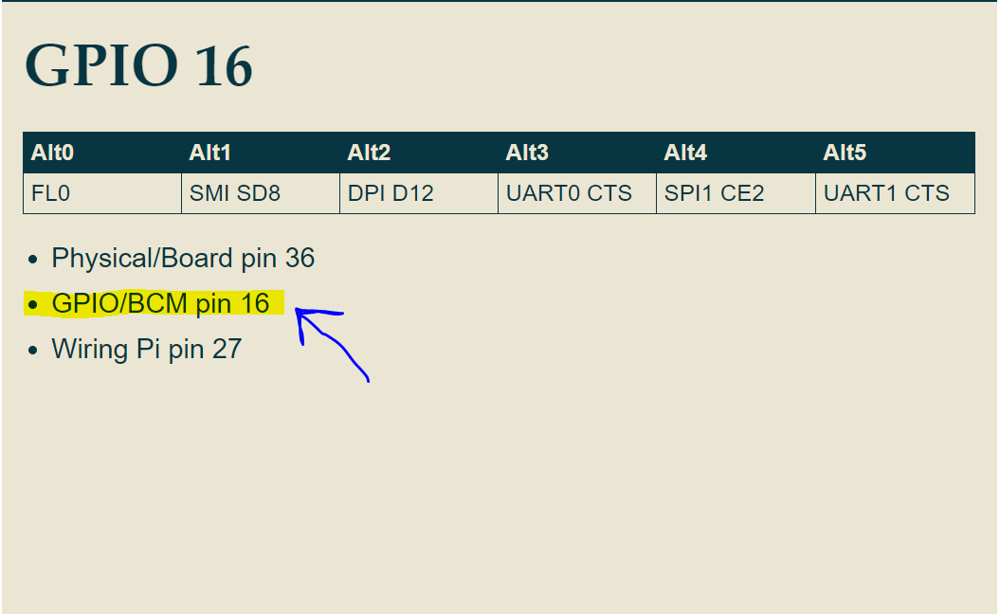

---
# Specifies the "filament" HTML page to be used. The HTML page must be located in the "_layouts" folder.
# (should always be this)
layout: alwaysnaviffamily

# Page title
# If omitted, the page will not be included in the navbar
title: MMM-DHT-Sensor

# Specifies the order of the current page from the point of view of the navbar
# Can have repetition in the numbers, for parent-child hierarchies
nav_order: 1

# Let exclude the page from the navbar
nav_exclude: false

# If this page represents the parent page of a section that, therefore, has children, specify it in the following way
has_children: false

# If this page represents the child page of a section that, therefore, has ONE parent page, specify it in the following way
# # parent: Namespace

# If this page is a parent page, a Table Of Contents will be automatically generated containing all related child pages. Use the option below to disable this functionality.
has_toc: false

# If a child page has more children, add again
# # has_children: true

# To the children page(s) add
# # parent: NOME_PAGINA_GENITORE
# # grand_parent: NOME_PAGINA_NONNO__GENITORE_DEL_GENITORE

# Let exclude the page from the search engine (client-side)
search_exclude: false
---

# MMM-DHT-Sensor
{: .no_toc }

---

<!-- Table of contents -->
<details open markdown="block">
  <summary>
    Table of contents
  </summary>
  {: .text-delta }
1. TOC
{:toc}
</details>

---

## tl;dr

Il seguente modulo visualizza i valori di temperatura
e umidità locali letti dal sensore interno del MagicMirror.

---

## Config JSON Fragment

```json
{
    "module": "MMM-DHT-Sensor",
    "config": {
        "sensorPin": 16,
        "sensorType": 22,
        "units": "metric",
        "updateInterval": 10000
    }
}
```

La proprietà `position`, con valore `""`, indica che il modulo non verrà visualizzato (non avrà
una schermata di proprietà). Comunque, il modulo __E' IN FUNZIONE__.

---

## Proprietà (Config Section)

| Proprietà        | Tipo      | Valori                                                                                                                                                                                                                          | Valore Default   | Inderogabilità | Descrizione                                                                                                           |
| ---------------- | --------- | ------------------------------------------------------------------------------------------------------------------------------------------------------------------------------------------------------------------------------- | ---------------- | -------------- | --------------------------------------------------------------------------------------------------------------------- |
| `sensorPin`      | `Integer` | Qualsiasi valore numerico di pin GPIO valido. Qui maggiori dettagli: [https://www.raspberrypi.org/documentation/usage/gpio/](https://www.raspberrypi.org/documentation/usage/gpio/), [https://pinout.xyz/](https://pinout.xyz/) | `---`            | `REQUIRED`     | Pin GPIO al quale il sensore interno del MagicMirror è connesso. __E' sconsigliata la modifica di questa proprietà.__ |
| `sensorType`     | `Integer` | `11` per il sensore `DHT11`. <br> `22` per il sensore `DHT22` o `AM2302`.                                                                                                                                                       | `---`            | `REQUIRED`     | Tipologia di sensore. __E' sconsigliata la modifica di questa proprietà.__                                            |
| `units`          | `String`  | `config.units` Valore specificato nel file _config.js_. <br> `"metric"` Celsius. <br> `"imperial"` Fahrenheit.                                                                                                                  | `config.units`   | `OPTIONAL`     | Unità per la visualizzazione della temperatura.                                                                       |
| `updateInterval` | `Integer` | Qualsiasi valore `>= 2000` in millisecondi _(vedi anche paragrafo `updateInterval Sensore`)_.                                                                                                                                   | `3.6e+6` (1 ora) | `OPTIONAL`     | Tempo di aggiornamento dei valori visualizzati con le letture dal sensore.                                            |

---

## Notifiche

Le notifiche sono uno strumento utilizzato dai moduli per comunicare con:

- L'OS del MagicMirror
- Altri moduli
- Attori umani

| Notifica             | Direzione | Trigger                                                                   | Payload _(inline js)_        | Descrizione                                                                                                                            |
| -------------------- | --------- | ------------------------------------------------------------------------- | ---------------------------- | -------------------------------------------------------------------------------------------------------------------------------------- |
| `INDOOR_TEMPERATURE` | `OUT`     | Ad ogni aggiornamento dei valori visualizzati con le letture dal sensore. | `{indoor_temperature_value}` | Fornisce ai moduli che accettano in `IN` questa notifica il valore della temperatura locale letta dal sensore interno del MagicMirror. |
| `INDOOR_HUMIDITY`    | `OUT`     | Ad ogni aggiornamento dei valori visualizzati con le letture dal sensore. | `{indoor_humidity_value}`    | Fornisce ai moduli che accettano in `IN` questa notifica il valore della umidità locale letta dal sensore interno del MagicMirror.     |

---

## Screenshots

Schermata del modulo funzionante correttamente. Il modulo è configurato per la visualizzazione
con una propria schermata (ownshow):


Schermata del modulo funzionante correttamente. Il modulo è configurato per la visualizzazione
delegando la visualizzazione ad un'altra schermata (di un altro modulo) (delegateshow):



---

## MagicMirror Default Hardware

Il sensore interno del MagicMirror è il `DHT22`.
Il pin GPIO utilizzato dal sensore è il `GPIO/BCM 16` [https://pinout.xyz/pinout/pin36_gpio16](https://pinout.xyz/pinout/pin36_gpio16).

## updateInterval Sensore

Le specifiche tecniche per il sensore `DHT22` raccomandano un valore
di campionamento __non__ inferiore a `2000 ms`.

## pin GPIO

__Presta Attenzione:__ i pin GPIO del Raspberry Pi possono essere riferiti
seguendo (molti) diversi standard. La proprietà `sensorPin` del modulo utilizza
lo standard evidenziato in giallo:


