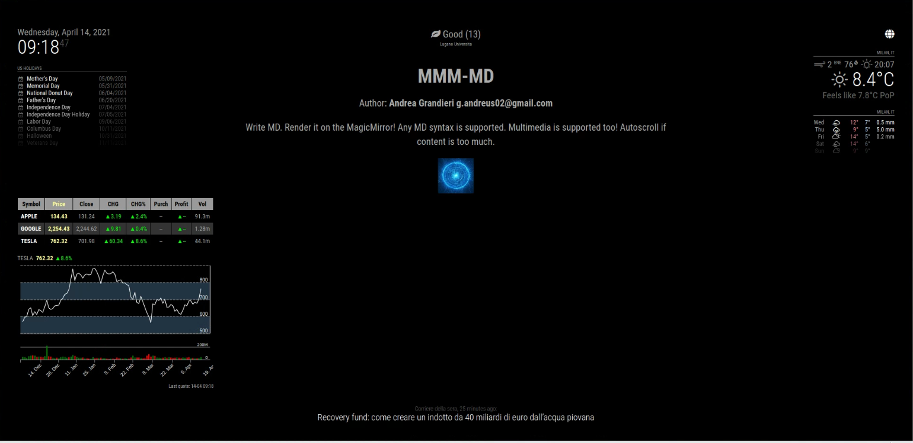

---
# Specifies the "filament" HTML page to be used. The HTML page must be located in the "_layouts" folder.
# (should always be this)
layout: alwaysnaviffamily

# Page title
# If omitted, the page will not be included in the navbar
title: MMM-MD

# Specifies the order of the current page from the point of view of the navbar
# Can have repetition in the numbers, for parent-child hierarchies
nav_order: 9

# Let exclude the page from the navbar
nav_exclude: false

# If this page represents the parent page of a section that, therefore, has children, specify it in the following way
has_children: false

# If this page represents the child page of a section that, therefore, has ONE parent page, specify it in the following way
parent: Documentazione Moduli
grand_parent: MagicMirror-GBM

# If this page is a parent page, a Table Of Contents will be automatically generated containing all related child pages. Use the option below to disable this functionality.
has_toc: false

# If a child page has more children, add again
# # has_children: true

# To the children page(s) add
# # parent: NOME_PAGINA_GENITORE
# # grand_parent: NOME_PAGINA_NONNO__GENITORE_DEL_GENITORE

# Let exclude the page from the search engine (client-side)
search_exclude: false
---

# MMM-MD
{: .no_toc }

---

<!-- Table of contents -->
<details open markdown="block">
  <summary>
    Table of contents
  </summary>
  {: .text-delta }
1. TOC
{:toc}
</details>

---

## tl;dr

Scrivi Markdown, renderizzalo e visualizzalo direttamente sullo schermo del MagicMirror!

Hai solamente bisogno di:

- Consocenza base di Markdown [https://guides.github.com/features/mastering-markdown/](https://guides.github.com/features/mastering-markdown/)
- Creatività

Tutte le sintassi MD sono supportate. Assets multimediali sono supportati. Autoscroll (dall'alto verso il basso con ripetizione)
se il contenuto eccede lo spazio a disposizione del modulo per il rendering.

---

## Config JSON Fragment

```json
{
    "module": "MMM-MD",
    "position": "center",
    "config": {
    }
}
```

---

## Proprietà (Config Section)

| Proprietà  | Tipo      | Valori                                                                                                                                        | Valore Default         | Inderogabilità | Descrizione                                                                                                                    |
| ---------- | --------- | --------------------------------------------------------------------------------------------------------------------------------------------- | ---------------------- | -------------- | ------------------------------------------------------------------------------------------------------------------------------ |
| `interval` | `Integer` | Qualsiasi valore `>= 45` (ms)                                                                                                                 | `50` (ms)              | `OPTIONAL`     | Velocità dell'autoscroll.                                                                                                      |
| `staller`  | `Integer` | Qualsiasi valore `>= 0` (ms)                                                                                                                  | `100` (ms)             | `OPTIONAL`     | Lasso di tempo prima di ripartire dal __TOP__ (dall'alto) dopo che l'autoscroll ha raggiunto il limite __BOTTOM__ (dal basso). |
| `width`    | `String`  | Qualsiasi stringa rappresentante CSS valido                                                                                                   | `"calc(100 % - 25 %)"` | `OPTIONAL`     | Larghezza della finestra del modulo.                                                                                           |
| `height`   | `String`  | Qualsiasi stringa rappresentante CSS valido                                                                                                   | `"500px"`              | `OPTIONAL`     | Altezza della finestra del modulo.                                                                                             |
| `docname`  | `String`  | Path (Percorso) di localizzazione di un valido documento. __Il documento deve essere localizzato all'interno di: `./modules/MMM-MD/public/`__ | `"content.md"`         | `OPTIONAL`     | Documento MD dal quale prelevare il contenuto MD da renderizzare.                                                              |

---

## Notifiche

Le notifiche sono uno strumento utilizzato dai moduli per comunicare con:

- L'OS del MagicMirror
- Altri moduli
- Attori umani

_Nulla da segnalare._

---

## Screenshots

Interfaccia del modulo funzionante (1):


Interfaccia del modulo funzionante (2):



---

## Localizzazione dei Documenti

Tutti i documenti MD e gli assets (multimedia) devono essere localizzati all'interno di: __`./modules/MMM-MD/public/`__
per essere rilevati e utilizzati dal modulo. Solo un documento alla volta può essere eletto al rendering.

Per puntare ed utilizzare un asset all'interno del documento MD, segui il seguente _path pattern_:

```md

```
