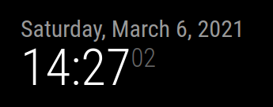

---
# Specifies the "filament" HTML page to be used. The HTML page must be located in the "_layouts" folder.
# (should always be this)
layout: alwaysnaviffamily

# Page title
# If omitted, the page will not be included in the navbar
title: clock

# Specifies the order of the current page from the point of view of the navbar
# Can have repetition in the numbers, for parent-child hierarchies
nav_order: 1

# Let exclude the page from the navbar
nav_exclude: false

# If this page represents the parent page of a section that, therefore, has children, specify it in the following way
has_children: false

# If this page represents the child page of a section that, therefore, has ONE parent page, specify it in the following way
# # parent: Namespace

# If this page is a parent page, a Table Of Contents will be automatically generated containing all related child pages. Use the option below to disable this functionality.
has_toc: false

# If a child page has more children, add again
# # has_children: true

# To the children page(s) add
# # parent: NOME_PAGINA_GENITORE
# # grand_parent: NOME_PAGINA_NONNO__GENITORE_DEL_GENITORE

# Let exclude the page from the search engine (client-side)
search_exclude: false
---

# clock
{: .no_toc }

---

<!-- Table of contents -->
<details open markdown="block">
  <summary>
    Table of contents
  </summary>
  {: .text-delta }
1. TOC
{:toc}
</details>

---

## tl;dr

Il seguente modulo mostra la data e l'ora correnti.

---

## Config JSON Fragment

```json
{
    "module": "clock",
    "position": "top_left",
    "config": {
        "timeFormat": 24,
        "displaySeconds": true,
        "showDate": true,
        "displayType": "digital",
        "timezone": "Europe/Rome"
    }
}
```

---

## Proprietà (Config Section)

| Proprietà        | Tipo      | Valori                                                                                       | Valore Default        | Inderogabilità | Descrizione                                                         |
| ---------------- | --------- | -------------------------------------------------------------------------------------------- | --------------------- | -------------- | ------------------------------------------------------------------- |
| `timeFormat`     | `Number`  | `12` <br> `24`                                                                               | _`config.timeFormat`_ | `OPTIONAL`     | Formato dell'ora (12 o 24 ore)                                      |
| `displaySeconds` | `Boolean` | `true`: visualizzazione secondi attivato. <br> `false`: visualizzazione secondi disattivato. | `true`                | `OPTIONAL`     | Attiva / disattiva visualizzazione secondi.                         |
| `showDate`       | `Boolean` | `true`: visualizzazione data attivato. <br> `false`: visualizzazione data disattivato.       | `true`                | `OPTIONAL`     | Attiva / disattiva visualizzazione data.                            |
| `displayType`    | `String`  | `"digital"` <br> `"analog"` <br> `"both"`                                                    | `"digital"`           | `OPTIONAL`     | Visualizzazione orario come orologio analogico, digitale o entrambi |
| `timezone`       | `String`  | Qui puoi trovare / cercare tutte le possibili zone: https://momentjs.com/timezone/.          | `---`                 | `REQUIRED`     | Zona di cui mostrare l'ora                                          |

---

## Notifiche

Le notifiche sono uno strumento utilizzato dai moduli per comunicare con:

- L'OS del MagicMirror
- Altri moduli
- Attori umani

| Notifica       | Direzione | Trigger               | Payload _(inline js)_ | Descrizione |
| -------------- | --------- | --------------------- | --------------------- | ----------- |
| `CLOCK_SECOND` | `OUT`     | Ogni secondo passato. | `second_value`        | ---         |
| `CLOCK_MINUTE` | `OUT`     | Ogni munuto passato.  | `minute_value`        | ---         |

---

## Screenshots

Questa è la visualizzazione del modulo in situazione di funzionamento corretto:



---
