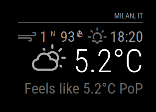
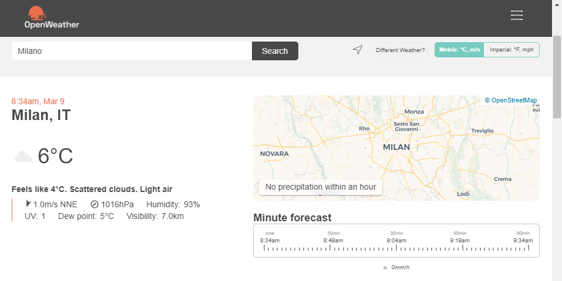

---
# Specifies the "filament" HTML page to be used. The HTML page must be located in the "_layouts" folder.
# (should always be this)
layout: alwaysnaviffamily

# Page title
# If omitted, the page will not be included in the navbar
title: weather

# Specifies the order of the current page from the point of view of the navbar
# Can have repetition in the numbers, for parent-child hierarchies
nav_order: 6

# Let exclude the page from the navbar
nav_exclude: false

# If this page represents the parent page of a section that, therefore, has children, specify it in the following way
has_children: false

# If this page represents the child page of a section that, therefore, has ONE parent page, specify it in the following way
parent: Documentazione Moduli
grand_parent: MagicMirror-GBM

# If this page is a parent page, a Table Of Contents will be automatically generated containing all related child pages. Use the option below to disable this functionality.
has_toc: false

# If a child page has more children, add again
# # has_children: true

# To the children page(s) add
# # parent: NOME_PAGINA_GENITORE
# # grand_parent: NOME_PAGINA_NONNO__GENITORE_DEL_GENITORE

# Let exclude the page from the search engine (client-side)
search_exclude: false
---

# weather
{: .no_toc }

---

<!-- Table of contents -->
<details open markdown="block">
  <summary>
    Table of contents
  </summary>
  {: .text-delta }
1. TOC
{:toc}
</details>

---

## tl;dr

Visualizza il meteo per il giorno corrente.

---

## Config JSON Fragment

```json
{
    "module": "weather",
    "position": "top_right",
    "config": {
        "weatherProvider": "openweathermap",
        "units": "metric",
        "degreeLabel": true,
        "updateInterval": 600000,
        "lang": "en",
        "initialLoadDelay": 1000,
        "onlyTemp": false,
        "showHumidity": true,
        "showIndoorTemperature": true,
        "showIndoorHumidity": true,
        "showSun": true,
        "colored": true,
        "showPrecipitationAmount": true,
        "maxNumberOfDays": 5,
        "locationID": "",
        "apiKey": "YOUR_OPENWEATHERMAP_APIKEY"
    }
}
```

---

## Proprietà (Config Section)

| Proprietà                 | Tipo      | Valori                                                                                                                                                                                                           | Valore Default     | Inderogabilità | Descrizione                                                                                                  |
| ------------------------- | --------- | ---------------------------------------------------------------------------------------------------------------------------------------------------------------------------------------------------------------- | ------------------ | -------------- | ------------------------------------------------------------------------------------------------------------ |
| `weatherProvider`         | `String`  | `"openweathermap"` <br> `"darksky"` <br> `"weathergov"` <br> `"ukmetoffice"` <br> `"weatherbit"`                                                                                                                 | `"openweathermap"` | `OPTIONAL`     | API.                                                                                                         |
| `units`                   | `String`  | `config.units`: Acquisizione del valore specificato nel file _config.js_. <br> `"default"`: Kelvin. <br> `"metric"`: Celsius. <br> `"imperial"`: Fahrenheit.                                                     | `config.units`     | `OPTIONAL`     | Unità di misura per i gradi.                                                                                 |
| `degreeLabel`             | `Boolean` | `true`: Attiva la visualizzazione dell'unità di misura _(etichetta)_ per i gradi in uso. <br> `false`: Disattiva la visualizzazione dell'unità di misura _(etichetta)_ per i gradi in uso.                       | `false`            | `OPTIONAL`     | Attiva la visualizzazione dell'unità di misura _(etichetta)_ per i gradi in uso.                             |
| `updateInterval`          | `Number`  | `1000 <= milliseconds <= 86400000`                                                                                                                                                                               | `600000`           | `OPTIONAL`     | Frequenza di aggiornamento / richiesta contenuti aggiornati.                                                 |
| `lang`                    | `String`  | `config.language`: Acquisizione del valore specificato nel file _config.js_. <br> `"en"` <br> `"nl"` <br> `"ru"` _ect..._.                                                                                       | `config.language`  | `OPTIONAL`     | Lingua per la visualizzazione del nome dei giorni della settimana.                                           |
| `initialLoadDelay`        | `Number`  | `1000 <= milliseconds <= 5000`                                                                                                                                                                                   | `0`                | `OPTIONAL`     | Delay di sicurezza prima di avviare il caricamento di questo modulo durante la fase di boot del MagicMirror. |
| `onlyTemp`                | `Boolean` | `true`: Attiva la visualizzazione limitata alla solo temperatura. <br> `false`: Disattiva la visualizzazione limitata alla solo temperatura.                                                                     | `false`            | `OPTIONAL`     | Attiva la visualizzazione limitata alla solo temperatura.                                                    |
| `showHumidity`            | `Boolean` | `true`: Attiva la visualizzazione dell'umidità. <br> `false`: Disattiva la visualizzazione dell'umidità.                                                                                                         | `false`            | `OPTIONAL`     | Attiva la visualizzazione dell'umidità.                                                                      |
| `showIndoorTemperature`   | `Boolean` | `true`: Attiva la visualizzazione della temperatura interna _(locale di collocamento MagicMirror)_. <br> `false`: Disattiva la visualizzazione della temperatura interna _(locale di collocamento MagicMirror)_. | `false`            | `OPTIONAL`     | Attiva la visualizzazione della temperatura interna _(locale di collocamento MagicMirror)_.                  |
| `showIndoorHumidity`      | `Boolean` | `true`: Attiva la visualizzazione dell'umidità interna _(locale di collocamento MagicMirror)_. <br> `false`: Disattiva la visualizzazione dell'umidità interna _(locale di collocamento MagicMirror)_.           | `false`            | `OPTIONAL`     | Attiva la visualizzazione dell'umidità interna _(locale di collocamento MagicMirror)_.                       |
| `showSun`                 | `Boolean` | `true`: Attiva la visualizzazione dei cicli del Sole (Alba, Tramonto). <br> `false`: Disattiva la visualizzazione dei cicli del Sole (Alba, Tramonto).                                                           | `true`             | `OPTIONAL`     | Attiva la visualizzazione dei cicli del Sole (Alba, Tramonto).                                               |
| `colored`                 | `Boolean` | `true`: Attiva la visualizzazione delle temperatura __MIN__ & __MAX__ in tonalità colorata. <br> `false`: Disattiva la visualizzazione delle temperatura __MIN__ & __MAX__ in tonalità colorata.                 | `false`            | `OPTIONAL`     | Attiva la visualizzazione delle temperatura __MIN__ & __MAX__ in tonalità colorata.                          |
| `showPrecipitationAmount` | `Boolean` | `true`: Attiva la visualizzazione della quantità di precipitazioni (neve, pioggia). <br> `false`: Disattiva la visualizzazione della quantità di precipitazioni (neve, pioggia).                                 | `false`            | `OPTIONAL`     | Attiva la visualizzazione della quantità di precipitazioni (neve, pioggia).                                  |
| `maxNumberOfDays`         | `Number`  | `1 <= days <= 16`                                                                                                                                                                                                | `5`                | `OPTIONAL`     | Rappresenta il numero di giorni futuri di cui richiedere le informazioni meteo.                              |
| `locationID`              | `String`  | Visita [https://openweathermap.org/](https://openweathermap.org/) per ottenere l'ID zona _(segui istruzioni sotto)_.                                                                                             | `---`              | `REQUIRED`     | ID rappresentante univocamente la zona da analizzare per le informazioni meteo.                              |
| `apiKey`                  | `String`  | Visita [https://openweathermap.org/](https://openweathermap.org/) per ottenere la tua API KEY __(ad uso GRATUITO privata)__.                                                                                     | `---`              | `REQUIRED`     | La tua API KEY per l'utilizzo della OPENWEATHERMAP API.                                                      |

---

## Notifiche

Le notifiche sono uno strumento utilizzato dai moduli per comunicare con:

- L'OS del MagicMirror
- Altri moduli
- Attori umani

| Notifica             | Direzione | Trigger                                                                      | Payload _(inline js)_      | Descrizione                                                                 |
| -------------------- | --------- | ---------------------------------------------------------------------------- | -------------------------- | --------------------------------------------------------------------------- |
| `INDOOR_TEMPERATURE` | `IN`      | Visualizza la temperatura locale della zona di collocazione del MagicMirror. | `INDOOR_TEMPERATURE_VALUE` | Notifica in funzione solo se il valore di `showIndoorTemperature` è `true`. |
| `INDOOR_HUMIDITY`    | `IN`      | Visualizza l'umidità locale della zona di collocazione del MagicMirror.      | `INDOOR_HUMIDITY_VALUE`    | Notifica in funzione solo se il valore di `showIndoorHumidity` è `true`.    |

---

## Screenshots

Schermata del modulo funzionante:

[](../../../assets/weather/working_module.PNG)

---

## Requisiti Privati

Ottieni la tua API KEY per le API di OPENWEATHERMAP: [https://openweathermap.org/](https://openweathermap.org/).

E' necessaria una API KEY per l'utilizzo del modulo, in quanto quest'ultimo
utilizza le API di OPENWEATHERMAP. L'utilizzo delle API effettuato in modo
automatico da questo modulo è conforme agli standard di utilizzo delle suddette
API, ed è totalmente gratuito (nei limiti di utilizzo privato effettuato
in modo automatico da questo modulo).

---

## locationID

La proprietà `locationID` identifica univocamente una località nell'intero mondo.
Questo codice semplifica l'atto di specificazione della zona da analizzare,
in quanto quest'ultima viene, appunto, identificata univocamente.

Per ottenere il valore di `locationID`:

- Visita prima di tutto: [https://openweathermap.org/](https://openweathermap.org/).
- Utilizza <br> [](../../../assets/weather/search_bar_getlocationID.PNG) <br>
  per cercare la tua zona di interesse.
- Una volta effettuata la ricerca <br> [](../../../assets/weather/search_bar_used_getlocationID.PNG) <br>
  potrai notare che l'__URL__ della pagina correntemente visualizzata contiene proprio
  il valore di `locationID`: <br>
  [](../../../assets/weather/url_gotlocationID.PNG)
