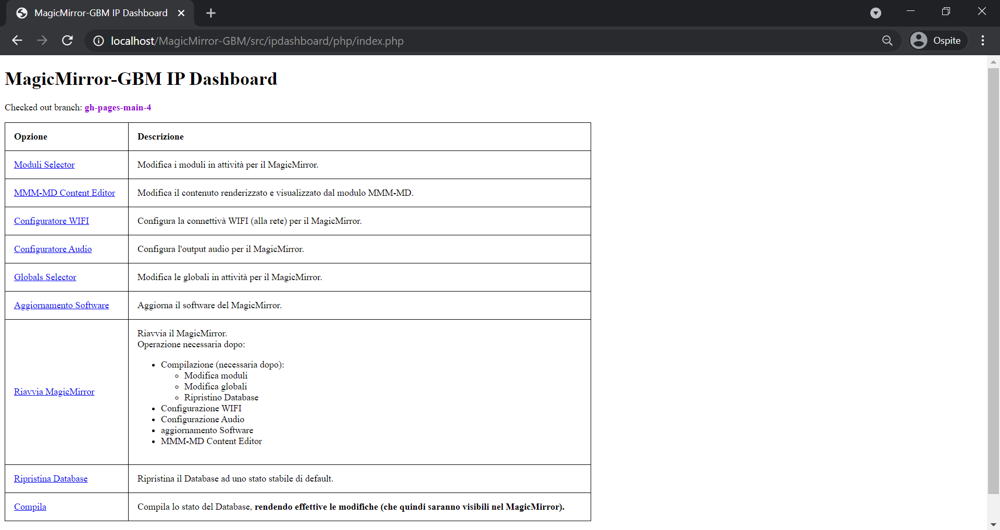
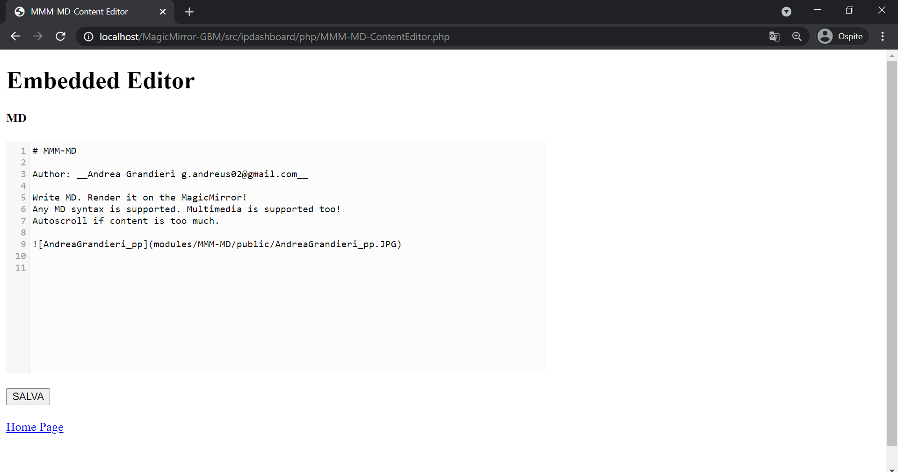
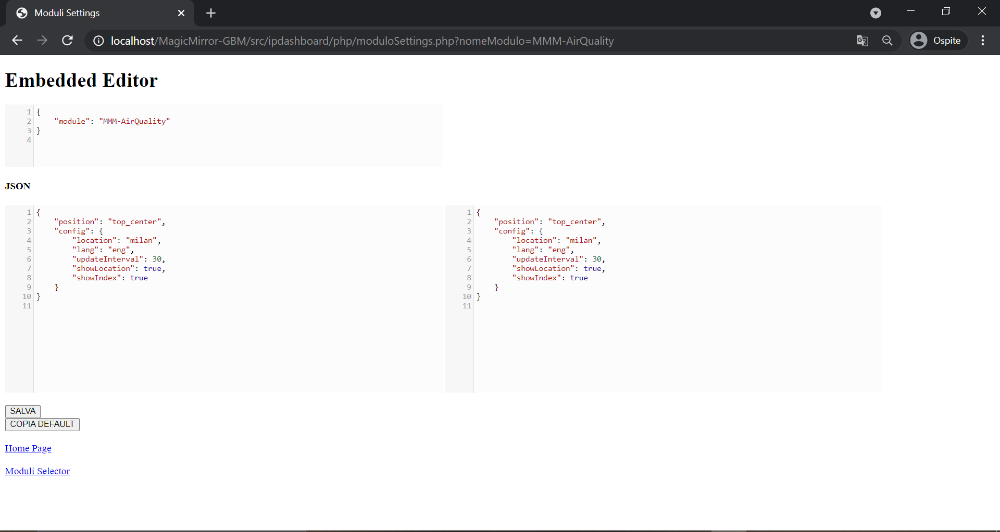
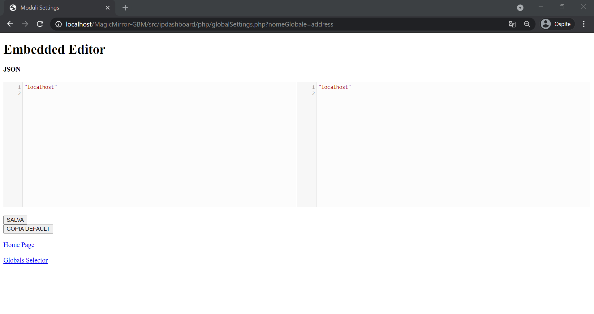
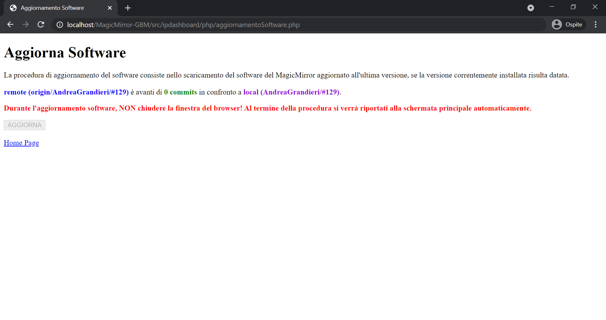
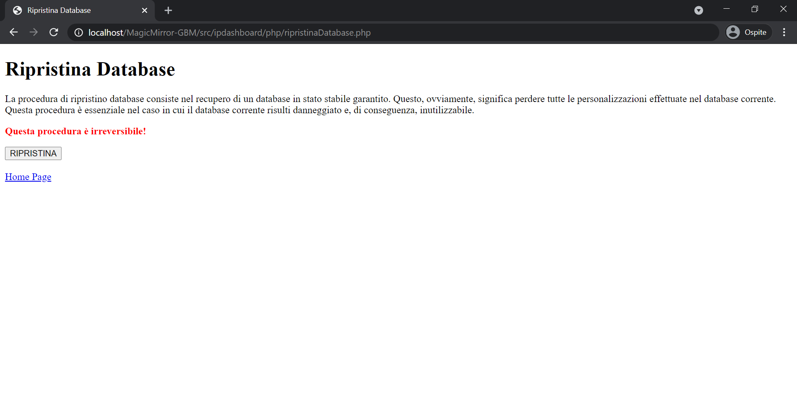

---
# Specifies the "filament" HTML page to be used. The HTML page must be located in the "_layouts" folder.
# (should always be this)
layout: alwaysnaviffamily

# Page title
# If omitted, the page will not be included in the navbar
title: MagicMirror-GBM IP Dashboard

# Specifies the order of the current page from the point of view of the navbar
# Can have repetition in the numbers, for parent-child hierarchies
nav_order: 2

# Let exclude the page from the navbar
nav_exclude: false

# If this page represents the parent page of a section that, therefore, has children, specify it in the following way
has_children: false

# If this page represents the child page of a section that, therefore, has ONE parent page, specify it in the following way
parent: MagicMirror-GBM

# If this page is a parent page, a Table Of Contents will be automatically generated containing all related child pages. Use the option below to disable this functionality.
has_toc: false

# If a child page has more children, add again
# # has_children: true

# To the children page(s) add
# # parent: NOME_PAGINA_GENITORE
# # grand_parent: NOME_PAGINA_NONNO__GENITORE_DEL_GENITORE

# Let exclude the page from the search engine (client-side)
search_exclude: false
---

# MagicMirror-GBM IP Dashboard
{: .no_toc }

---

<!-- Table of contents -->

  

    Table of contents
  

  {: .text-delta }
1. TOC
{:toc}

---

Il MagicMirror-GBM può essere configurato grazie alla sua interfaccia web: `MagicMirror-GBM IP Dashboard`.
Essa mette a disposizione diversi strumenti per configurare diversi aspetti del MagicMirror-GBM.
Qui riportati e descritti:

> index.php

Home Page. Da qui puoi accedere le diverse funzionalità dell'interfaccia.

---

> MMM-MD-ContentEditor.php

Embedded editor MD. Qui puoi modificare il contenuto renderizzato e visualizzato dal modulo MMM-MD.
Qui per maggiori informazioni: [https://github.com/AndreaGrandieri/MMM-MD](https://github.com/AndreaGrandieri/MMM-MD)

---

> moduliSelector.php

Lista dei moduli presenti nel Database del MagicMirror-GBM.
Da qui puoi:

- Attivare / Disattivare modulo
- Cambiare ordine di render grafico del modulo
- Accedere all'embedded editor per modificare il frammento di configurazione del modulo

---

> moduloSettings.php

Embedded editor JSON. Qui puoi modificare il frammento JSON di configurazione del modulo selezionato. __E' raccomandato seguire le indicazioni riportate nei documenti dedicati [https://andreagrandieri.github.io/MagicMirror-GBM/#indice-moduli](https://andreagrandieri.github.io/MagicMirror-GBM/#indice-moduli)__

---

> WIFIConfigurator.php

Da qui puoi modificare le impostazioni relative alla configurazione della connettività WIFI (alla rete) per il MagicMirror-GBM. _Probabilmente ti troverai qui durante la fase di prime._

---

> AudioConfigurator.php

Da qui puoi modificare le impostazioni relative alla configurazione dei dispositivi di output audio per il MagicMirror-GBM.

---

> globalsSelector.php

Lista delle globali presenti nel Database del MagicMirror-GBM.
Da qui puoi:

- Accedere all'embedded editor per modificare il frammento di configurazione della globale

---

> globalSettings.php

Embedded editor JSON. Qui puoi modificare il frammento JSON di configurazione della globale selezionata. __E' sconsigliata la modifica di queste informazioni se non strettamente necessario.__

---

> aggiornamentoSoftware.php

Da qui puoi aggiornare il software del MagicMirror-GBM.

---

> doReboot.php

Riavvia il MagicMirror-GBM.

---

> ripristinaDatabase.php

Da qui puoi ripristinare il Database interno del MagicMirror-GBM ad uno stato stabile sicuramente funzionale e corretto.

---

> compila.php

Compila lo stato del Database, rendendo effettive le modifiche effettuate _(con le schermate precedenti)_.

