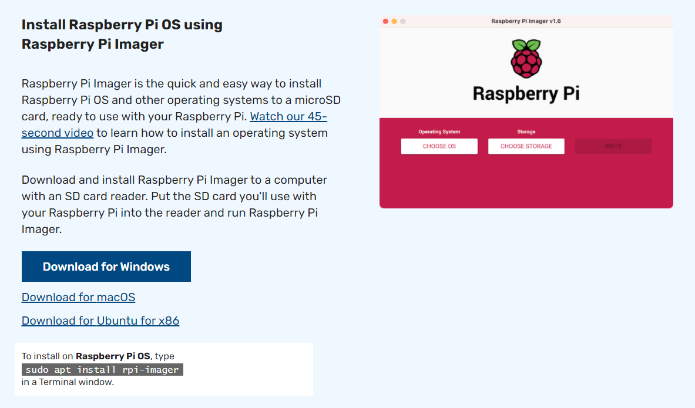
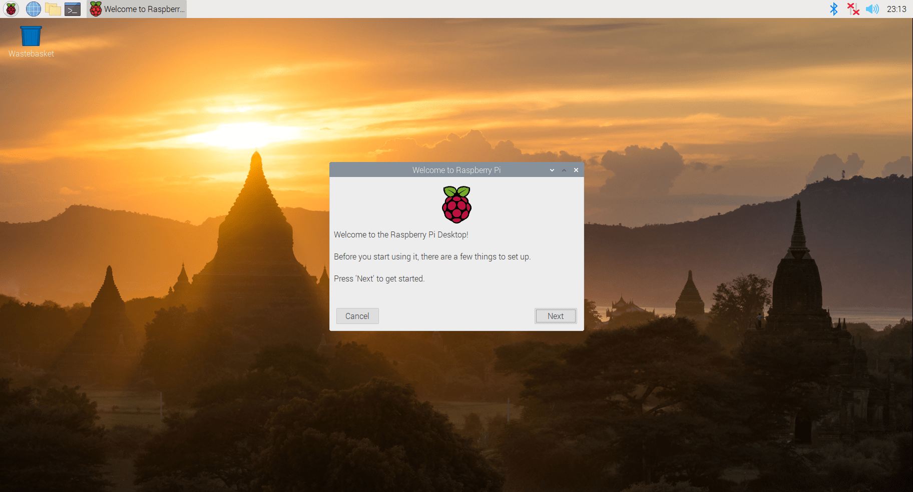
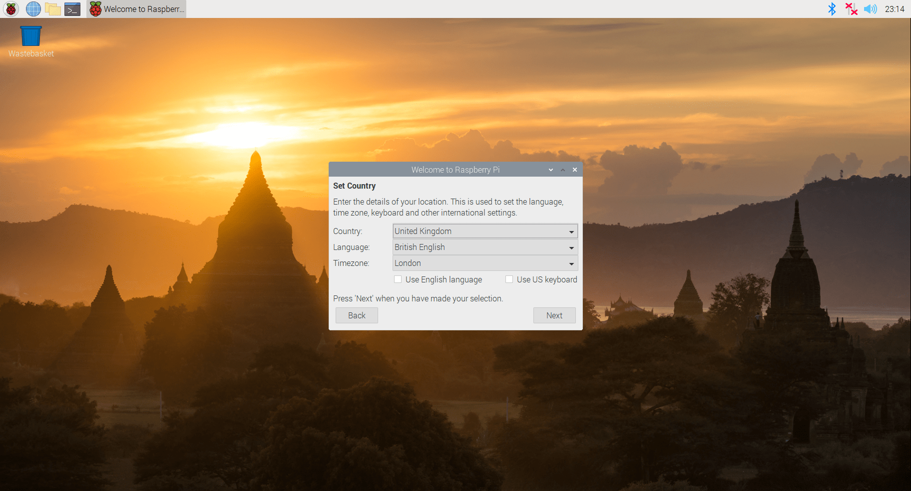
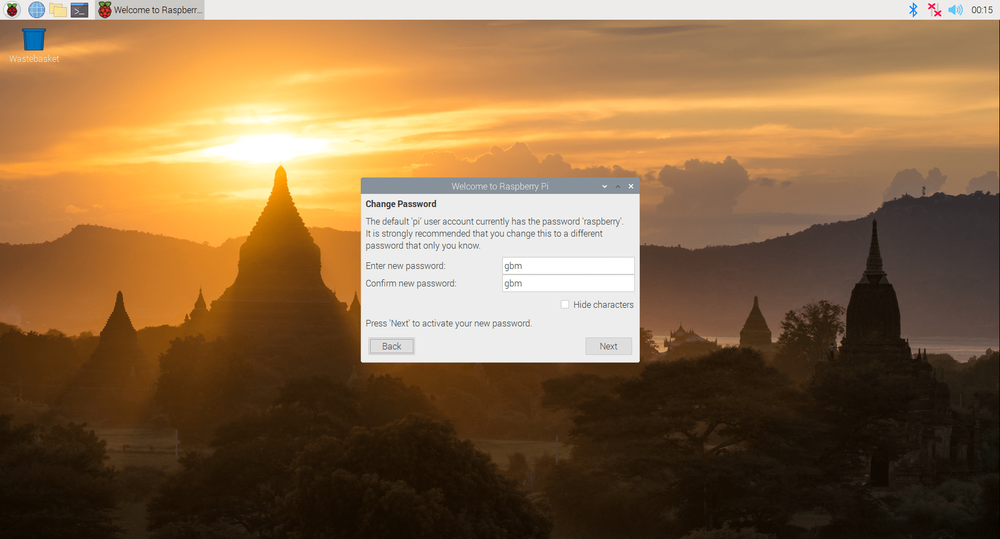

---
# Specifies the "filament" HTML page to be used. The HTML page must be located in the "_layouts" folder.
# (should always be this)
layout: default

# Page title
# If omitted, the page will not be included in the navbar
title: MagicMirror-GBM OS

# Specifies the order of the current page from the point of view of the navbar
# Can have repetition in the numbers, for parent-child hierarchies
nav_order: 1

# Let exclude the page from the navbar
nav_exclude: false

# If this page represents the parent page of a section that, therefore, has children, specify it in the following way
has_children: false

# If this page represents the child page of a section that, therefore, has ONE parent page, specify it in the following way
parent: MagicMirror-GBM

# If this page is a parent page, a Table Of Contents will be automatically generated containing all related child pages. Use the option below to disable this functionality.
has_toc: false

# If a child page has more children, add again
# # has_children: true

# To the children page(s) add
# # parent: NOME_PAGINA_GENITORE
# # grand_parent: NOME_PAGINA_NONNO__GENITORE_DEL_GENITORE

# Let exclude the page from the search engine (client-side)
search_exclude: false
---

# MagicMirror-GBM-OS
{: .no_toc }

---

<!-- Table of contents -->
<details open markdown="block">
  <summary>
    Table of contents
  </summary>
  {: .text-delta }
1. TOC
{:toc}
</details>

---

Il MagicMirror-GBM è reso funzionale dal suo sistema operativo: `MagicMirror-GBM-OS`.

- <i class="fa-solid fa-file-zipper fa-2x"></i> [MagicMirror-GBM-OS_v1.3.img.gz](https://api.onedrive.com/v1.0/shares/u!aHR0cHM6Ly8xZHJ2Lm1zL3UvcyFBbXN0V05uOEVrRXVoSnRPbFl2MlZrRTNMV3I0blE_ZT1YWDFoREM/root/content)

Puoi scrivere / flashare l'OS su una scheda SD pronta all'uso in un sistema Raspberry Pi usando
il software `Raspberry Pi Imager` ([https://www.raspberrypi.org/software/](https://www.raspberrypi.org/software/)).

[](../assets/MagicMirror-OS/flash-using-raspberry-pi-imager.PNG)

---

## Specifiche

Ecco riportate le principali caratteristiche e requisiti essenziali:

- Distribuzione: `Raspberry Pi OS (32-bit)`
- Raspberry Pi: `3 o superiore`
- __nodejs: `v10.24.0`__
- __npm: `v5.8.0`__
- Storage Memory: `minimo (rischioso) 8GB; minimo consigliato: 16GB`
- RAM: `minimo 1GB`
- Nome Personale: `pi`
- Nome PC: `magicmirrorgbm`
- Nome utente: `pi`
- Password: `gbm`
- Internet configurations: _none_

---

## Costruzione

Di seguito riportati i passaggi per costruire il `MagicMirror-GBM-OS` partendo da una distribuzione `Raspberry Pi OS Full (32-bit)` grezza.
Parte delle seguenti istruzioni sono compatibili per costruire la `MagicMirror-GBM-Emulation-VM`. Esse sono indicate con: ___(+VM)___:

1. __SOLO__ ___(+VM)___: Installare tools vmware:

    ```shell
    sudo apt install open-vm-tools-desktop open-vm-tools
    ```

2. Soddisfare la fase guidata di setup iniziale di Raspberry:

    1. Next

        [](../assets/MagicMirror-OS/default-rasp-guidedprime/1.png)

    2. Imposta località

        [](../assets/MagicMirror-OS/default-rasp-guidedprime/2.png)

    3. Imposta password

        [](../assets/MagicMirror-OS/default-rasp-guidedprime/3.png)

    4. Next

        [](../assets/MagicMirror-OS/default-rasp-guidedprime/4.png)

    5. Seleziona rete WIFI / Cablata

        [](../assets/MagicMirror-OS/default-rasp-guidedprime/5.png)

    6. __NON FARE L'AGGIORNAMENTO SOFTWARE__ (se lo fai, accertati di rispettare le versioni di `nodejs` e `npm` riportate nelle `Specifiche` sopra)

        [](../assets/MagicMirror-OS/default-rasp-guidedprime/6.png)

    7. Puoi anche assegnare un nome personalizzato al dispositivo Raspberry (per essere individuato più facilmente nella rete)

        [](../assets/MagicMirror-OS/default-rasp-guidedprime/7.png)

3. Disattivare spegnimento automatico schermo Raspberry:

    ```shell
    cd \

    # Accesso al file "autostart"
    sudo nano /etc/xdg/lxsession/LXDE-pi/autostart
    ```

    Appendere (in coda) al contenuto del file:

    ```plaintext
    @xset s off
    @xset -dpms
    ```

4. Installare `nodejs` ___(+VM)___:

    ```shell
    sudo apt install nodejs
    ```

5. Installare `npm` ___(+VM)___:

    ```shell
    sudo apt install npm
    ```

6. Installare `npm-recursive-install` ___(+VM)___:

    ```shell
    sudo npm i -g recursive-install
    ```

7. Installare `bcm2835`:

    ```shell
    wget http://www.airspayce.com/mikem/bcm2835/bcm2835-1.52.tar.gz
    tar zxvf bcm2835-1.52.tar.gz
    cd bcm2835-1.52
    ./configure
    make
    sudo make check
    sudo make install
    cd \
    ```

8. Installare `raspotify`:

    ```shell
    sudo curl -sL https://dtcooper.github.io/raspotify/install.sh | sh
    ```

9. __SOLO__ ___(+VM)___: Installare `git`:

    ```shell
    sudo apt install git
    ```

10. Clonare repo `AndreaGrandieri/MagicMirror-GBM` nella dir `~` ___(+VM)___:

    ```shell
    git clone https://www.github.com/AndreaGrandieri/MagicMirror-GBM
    ```

    Effettuare il checkout alla release (versione) desiderata (qui maggiori dettagli: [Release Log](ReleaseLog.md))

    ```shell
    cd MagicMirror-GBM/
    git checkout v.X.X -b v.X.X
    ```

11. Installare `electron` ___(+VM)___:

    ```shell
    cd src/

    npm install electron --save-dev
    cd \
    ```

12. Installazione LAMP (Linux, Apache, MySQL, PHP) ___(+VM)___:

    ```shell
    sudo apt install apache2
    sudo apt install mariadb-server
    sudo mysql_secure_installation
    ```

    mysql_secure_installation:

    ```plaintext
    Enter current password for root (enter for none): gbm
    Change the root password?: n
    Remove anonymous users: n
    Disallow root login remotely: n
    Remove test database and access to it: y
    Reload privilegies table now: y
    ```

    ```shell
    sudo apt install php libapache2-mod-php php-mysql
    ```

    Modifica della root di serving per Apache e rilascio consensi

    ```shell
    cd /etc/apache2/sites-available

    # Accesso al file "000-default.conf"
    sudo nano 000-default.conf
    ```

    Modificare l'opzione `DocumentRoot` nel file:

    ```conf
    DocumentRoot /home/pi/MagicMirror-GBM/src/ipdashboard
    ```

    Rilascio consensi:

    ```shell
    cd \
    cd /etc/apache2

    # Accesso al file "apache2.conf"
    sudo nano apache2.conf
    ```

    Modificare l'opzione `<Directory /></Directory>` nel file (dovrebbe trovarsi alla riga ___153___):

    ```conf
    <Directory />
        Options Indexes FollowSymLinks Includes ExecCGI
        AllowOverride All
        Require all granted
    </Directory>
    ```

    Installazione di sqlite:

    ```shell
    cd \
    sudo apt-get install php-sqlite3
    ```

    Riavviare il servizio `apache2`:

    ```shell
    sudo service apache2 restart
    ```

13. Modifica dei `sudoers`, in modo tale da permettere l'interfaccia IP l'esecuzione di
    alcuni comandi che richiedono privilegi di admin ___(+VM)___:

    ```shell
    # Accesso al file: "sudoers"
    sudo visudo
    ```

    Appendere (in coda) al contenuto del file:

    ```plaintext
    www-data ALL = NOPASSWD: /sbin/reboot, /sbin/halt
    ```

14. Fornisco permessi di scrittura file protetti all'interfaccia IP ___(+VM)___:

    ```shell
    sudo chown -R www-data:www-data /etc/default/raspotify
    sudo chmod -R g+w /etc/default/raspotify

    sudo chown -R www-data:www-data /etc/pulse/default.pa
    sudo chmod -R g+w /etc/pulse/default.pa

    sudo chown -R www-data:www-data /etc/wpa_supplicant/wpa_supplicant.conf
    sudo chmod -R g+w /etc/wpa_supplicant/wpa_supplicant.conf

    sudo chown -R www-data:www-data /home/pi/MagicMirror-GBM/src/ipdashboard/
    
    sudo chown -R www-data:www-data /home/pi/MagicMirror-GBM/src/config/config.js

    sudo chown -R www-data:www-data /home/pi/MagicMirror-GBM/src/modules/MMM-MD/public/content.md
    sudo chmod -R g+w /home/pi/MagicMirror-GBM/src/modules/MMM-MD/public/content.md
    ```

15. Imposto dispositivo di default per output audio (OS + Raspotify) + configurazione denominazione cast service per Raspotify:
    [https://github.com/AndreaGrandieri/MagicMirror-GBM/issues/76#issuecomment-827711074](https://github.com/AndreaGrandieri/MagicMirror-GBM/issues/76#issuecomment-827711074)
    [https://github.com/AndreaGrandieri/MagicMirror-GBM/issues/228#issuecomment-828311332](https://github.com/AndreaGrandieri/MagicMirror-GBM/issues/228#issuecomment-828311332)

    ```shell
    # Accesso al file "raspotify" (riferimenti utili: https://github.com/AndreaGrandieri/MagicMirror-GBM/issues/76#issuecomment-827711074)
    sudo nano /etc/default/raspotify
    ```

    Modificare l'opzione `DEVICE_NAME` nel file:

    ```plaintext
    DEVICE_NAME="MagicMirror-GBM-spotify-cast"
    ```

    Modifica l'opzione `OPTIONS` nel file:

    ```plaintext
    OPTIONS="--device hw:1"
    ```

    ```shell
    # Accesso al file "default.pa" (riferimenti utili: https://github.com/AndreaGrandieri/MagicMirror-GBM/issues/228#issuecomment-828311332)
    sudo nano /etc/pulse/default.pa
    ```

    Modifica l'opzione `set-default-sink` nel file:

    ```plaintext
    set-default-sink alsa_output.platform-bcm2835_audio.analog-stereo
    ```

16. Riavviare il Raspberry ___(+VM)___:

    ```shell
    sudo shutdown -r now
    ```

17. Eseguire installazione ricorsiva nella dir `~/MagicMirror-GBM/src` con checkout del branch `main` ___(+VM)___:

    ```shell
    cd MagicMirror-GBM/src/    

    npm-recursive-install
    ```

18. Impostare avvio automatico del servizio:

    ```shell
    sudo nano /etc/xdg/lxsession/LXDE-pi/autostart
    @npm run start --prefix /home/pi/MagicMirror-GBM/src/
    ```

19. Rimozione informazioni personali (WIFI (SSID + password))

    Cancellare tutto il contenuto del seguente file:

    ```shell
    sudo nano /etc/wpa_supplicant/wpa_supplicant.conf
    ```
