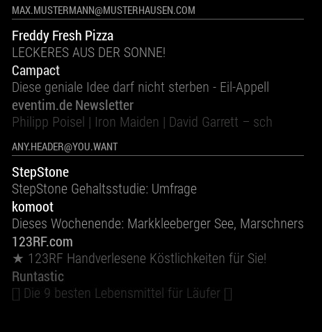
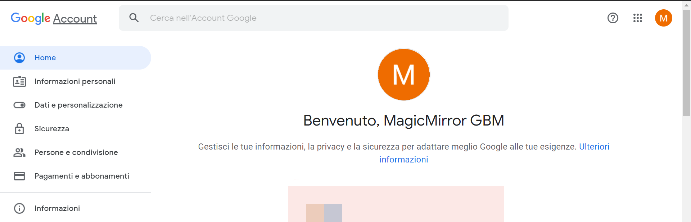
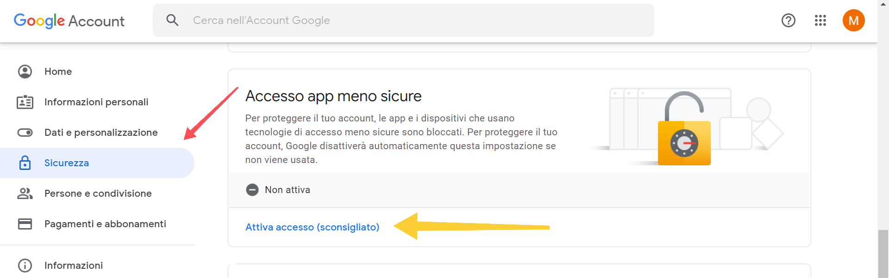
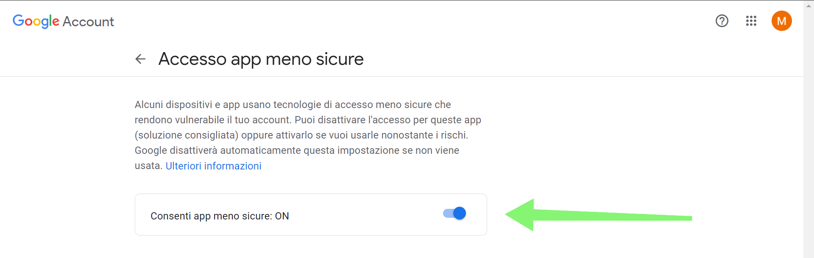

---
# Specifies the "filament" HTML page to be used. The HTML page must be located in the "_layouts" folder.
# (should always be this)
layout: default

# Page title
# If omitted, the page will not be included in the navbar
title: MMM-Mail

# Specifies the order of the current page from the point of view of the navbar
# Can have repetition in the numbers, for parent-child hierarchies
nav_order: 11

# Let exclude the page from the navbar
nav_exclude: false

# If this page represents the parent page of a section that, therefore, has children, specify it in the following way
has_children: false

# If this page represents the child page of a section that, therefore, has ONE parent page, specify it in the following way
parent: Documentazione Moduli
grand_parent: MagicMirror-GBM

# If this page is a parent page, a Table Of Contents will be automatically generated containing all related child pages. Use the option below to disable this functionality.
has_toc: false

# If a child page has more children, add again
# # has_children: true

# To the children page(s) add
# # parent: NOME_PAGINA_GENITORE
# # grand_parent: NOME_PAGINA_NONNO__GENITORE_DEL_GENITORE

# Let exclude the page from the search engine (client-side)
search_exclude: false
---

# MMM-Mail
{: .no_toc }

---

<!-- Table of contents -->
<details open markdown="block">
  <summary>
    Table of contents
  </summary>
  {: .text-delta }
1. TOC
{:toc}
</details>

---

## tl;dr

Il seguente modulo permette di consultare in lettura la tua casella di posta elettronica.

---

## Config JSON Fragment

```json
{
	"module": "MMM-Mail",
	"position": "bottom_left",
	"header": "Email",
	"config": {
		"user": "YOUR_EMAIL_ADDRESS_HERE",
		"pass": "YOUR_EMAIL_PASSWORD_HERE",
		"host": "imap.gmail.com",
		"port": 993,
		"numberOfEmails": 5,
		"fade": true,
		"subjectlength": 50
	}
}
```

---

## Proprietà (Config Section)

| Proprietà        | Tipo      | Valori                                                                                                               | Valore Default | Inderogabilità | Descrizione                                                      |
| ---------------- | --------- | -------------------------------------------------------------------------------------------------------------------- | -------------- | -------------- | ---------------------------------------------------------------- |
| `user`           | `String`  | Indirizzo email casella postale.                                                                                     | `---`          | `REQUIRED`     | Indirizzo email di cui si vogliono vedere le ultime N mail.      |
| `pass`           | `String`  | Password della casella postale.                                                                                      | `---`          | `REQUIRED`     | Password della casella postale.                                  |
| `host`           | `String`  | Nome host IMAP. _(vedi sotto per ulteriori dettagli)_                                                                | `---`          | `REQUIRED`     | Nome host IMAP.                                                  |
| `port`           | `Number`  | Porta. _(vedi sotto per ulteriori dettagli)_                                                                         | `---`          | `REQUIRED`     | Numero della porta che l'host IMAP utilizza.                     |
| `numberOfEmails` | `Number`  | Qualsiasi valore `> 0`.                                                                                              | `5`            | `OPTIONAL`     | Numero di mail da visualizzare.                                  |
| `fade`           | `Boolean` | `true`: Effetto dissolvenza mail più vecchie attivato <br> `false`: Effetto dissolvenza mail più vecchie disattivato | `true`         | `OPTIONAL`     | Attiva / Disattiva l'effetto dissolvenza delle mail più vecchie. |
| `subjectlength`  | `Number`  | Qualsiasi valore `> 0`.                                                                                              | `---`          | `OPTIONAL`     | Lunchezza massima per la visualizzazione di una mail.            |

---

## Screenshots

Questa è la visualizzazione del modulo in situazione di funzionamento corretto:

[](../../../assets/MMM-Mail/screenshot.PNG)

---

## Supporto Provider

Il modulo è in continuo aggiornamento con lo scopo di includere il numero maggiore possibile di provider di posta elettronica
compatibili. Di seguito un elenco riassuntivo dello stato di compatibilità ed inclusione:

| Provider                              | Supporto | Necessario `Low Level Security (App)` | Necessaria `Password per app` | Necessario `rejectUnauthorized` | Dettagli                                                                                                                |
| ------------------------------------- | -------- | ------------------------------------- | ----------------------------- | ------------------------------- | ----------------------------------------------------------------------------------------------------------------------- |
| GMAIL                                 | NO       | ---                                   | ---                           | ---                             | ---                                                                                                                     |
| MICROSOFT 365, OUTLOOK, HOTMAIL, LIVE | SI       | NO                                    | NO                            | NO                              | Riceve email e visualizza relativa notifica, ma la lista a schermo delle email NON viene compilata (aka: rimane vuota). |
| YAHOO                                 | SI       | NO                                    | SI                            | NO                              | ---                                                                                                                     |
| LIBERO                                | SI       | NO                                    | NO                            | NO                              | ---                                                                                                                     |
| ICLOUD                                | SI       | NO                                    | SI                            | NO                              | ---                                                                                                                     |

---

## Host IMAP

In base al provider di posta elettronica utilizzato, le impostazioni qui di seguito elencate possono
variare. __Attenersi ai valori qui riportati per garantire il corretto funzionamento del modulo.__
Se il provider da te cercato non è riportato nell'elenco, è facilmente reperibile dal web _(con una
ricerca del tipo: `{nome_provider} imap settings`)_:

> GMAIL

| Proprietà | Valore             |
| --------- | ------------------ |
| `host`    | `"imap.gmail.com"` |
| `port`    | `993`              |

> MICROSOFT 365
> OUTLOOK
> HOTMAIL
> LIVE

| Proprietà | Valore                    |
| --------- | ------------------------- |
| `host`    | `"outlook.office365.com"` |
| `port`    | `993`                     |

> YAHOO

| Proprietà | Valore                  |
| --------- | ----------------------- |
| `host`    | `"imap.mail.yahoo.com"` |
| `port`    | `993`                   |

> LIBERO

| Proprietà | Valore                 |
| --------- | ---------------------- |
| `host`    | `"imapmail.libero.it"` |
| `port`    | `993`                  |

> ICLOUD

| Proprietà | Valore               |
| --------- | -------------------- |
| `host`    | `"imap.mail.me.com"` |
| `port`    | `993`                |

---

## Accesso Low Level Security

Il seguente modulo, a causa di svariate limitazioni e complicazioni qui omesse per semplicità,
__NON SUPPORTA l'autenticazione sicura OAUTH o OAUTH2__.
Come diretta conseguenza, esso viene etichettato dai provider di posta elettronica
come `Less secure app` (italiano: `App meno sicura`).

> Dunque, per garantire il corretto funzionalmento del modulo, sarà necessario consentire
> l'accesso ad `App meno sicure` all'account email.

_Generalizzare questa procedura è complicato dato l'elevato numero di provider di posta
elettronica. E' facilmente possibile trovare informazioni sul web._ Riportiamo qui di seguito la procedura da effettuare con `GMAIL`, uno dei provider
più utilizzati:

1. Recarsi nella pagina di configurazione del proprio account Google:

	[https://myaccount.google.com/](https://myaccount.google.com/)

	[](../../../assets/MMM-Mail/step1.png)

2. Recarsi nella tab `Sicurezza` e selezionare / cliccare `Attiva accesso (sconsigliato)` nella opzione `Accesso app meno sicure`:

	[](../../../assets/MMM-Mail/step2.png)

3. Attivare l'opzione `Consenti app meno sicure`:

	[](../../../assets/MMM-Mail/step3.png)

---

## Password per App

Molti provider, per tutelare l'account del cliente utilizzatore, NON permettono l'utilizzo della _vera password_
dell'account di quest'ultimo in app di terze parti non riconosciute e / o verificate dal provider stesso.
Ovviamente, per non causare un fenomeno di _incompatibilità di massa_, i provider mettono a disposizione il sistema
delle: __Password per App__.
Brevemente, questo sistema permette di generare password univoche per ogni app di terze parti con la quale si vuole
utilizzare l'account utente del provider.
Ovviamente le password generate sono univoche, differenti dalla _vera password_ dell'account e funzionali sono per l'app
di terze parti target della generazione.
Con questo semplice metodo, è possibile tutelare (in gran parte) l'account utente (in quanto stiamo tutelando la _vera password_).
Inoltre, questo metodo è essenziale per interagire con app che non supportano fattori di autenticazione avanzati che, invece, il
provider prevede per l'accesso ai suoi servizi.

_Generalizzare la procedura per generare la password univoca per app di terze parti è complicato dato l'elevato numero di provider (di posta
elettronica e non solo). __E' facilmente possibile trovare informazioni sul web.___
