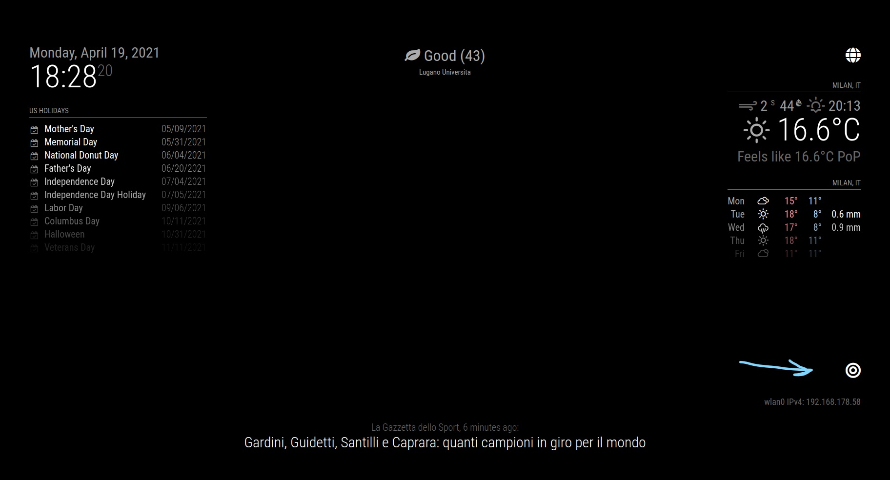
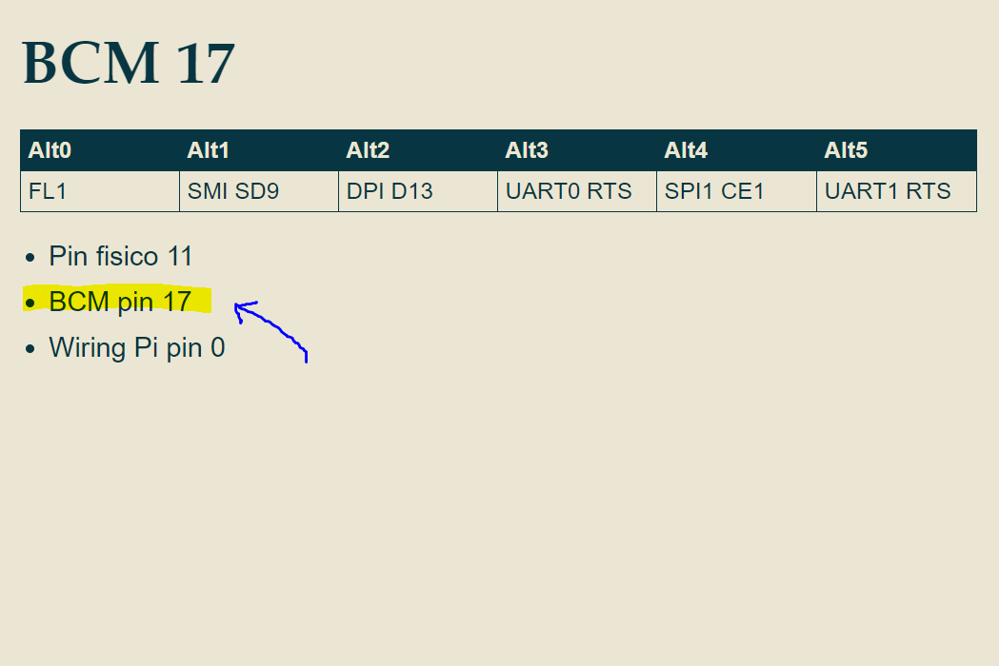

---
# Specifies the "filament" HTML page to be used. The HTML page must be located in the "_layouts" folder.
# (should always be this)
layout: default

# Page title
# If omitted, the page will not be included in the navbar
title: MMM-PIR-Sensor

# Specifies the order of the current page from the point of view of the navbar
# Can have repetition in the numbers, for parent-child hierarchies
nav_order: 14

# Let exclude the page from the navbar
nav_exclude: false

# If this page represents the parent page of a section that, therefore, has children, specify it in the following way
has_children: false

# If this page represents the child page of a section that, therefore, has ONE parent page, specify it in the following way
parent: Documentazione Moduli
grand_parent: MagicMirror-GBM

# If this page is a parent page, a Table Of Contents will be automatically generated containing all related child pages. Use the option below to disable this functionality.
has_toc: false

# If a child page has more children, add again
# # has_children: true

# To the children page(s) add
# # parent: NOME_PAGINA_GENITORE
# # grand_parent: NOME_PAGINA_NONNO__GENITORE_DEL_GENITORE

# Let exclude the page from the search engine (client-side)
search_exclude: false
---

# MMM-PIR-Sensor
{: .no_toc }

---

<!-- Table of contents -->
<details open markdown="block">
  <summary>
    Table of contents
  </summary>
  {: .text-delta }
1. TOC
{:toc}
</details>

---

## tl;dr

Interagisce con un sensore PIR (di movimento / di presenza) per attivare la modalità
di sospensione del MagicMirror quando necessario.

---

## Config JSON Fragment

```json
{
    "module": "MMM-PIR-Sensor",
    "position": "bottom_right",
    "config": {
        "sensorPin": 17,
        "powerSaving": true,
        "powerSavingDelay": 900,
        "powerSavingNotification": false,
        "powerSavingMessage": "Attivazione modalità sospensione...",
        "preventHDMITimeout": 5,
        "presenceIndicatorColor": "white",
        "runSimulator": false
    }
}
```

---

## Proprietà (Config Section)

| Proprietà                 | Tipo      | Valori                                                                                                                                                                                                                          | Valore Default                             | Inderogabilità | Descrizione                                                                                                                                                                                                                 |
| ------------------------- | --------- | ------------------------------------------------------------------------------------------------------------------------------------------------------------------------------------------------------------------------------- | ------------------------------------------ | -------------- | --------------------------------------------------------------------------------------------------------------------------------------------------------------------------------------------------------------------------- |
| `sensorPin`               | `Integer` | Qualsiasi valore numerico di pin GPIO valido. Qui maggiori dettagli: [https://www.raspberrypi.org/documentation/usage/gpio/](https://www.raspberrypi.org/documentation/usage/gpio/), [https://pinout.xyz/](https://pinout.xyz/) | `22`                                       | `OPTIONAL`     | Pin GPIO al quale il sensore interno del MagicMirror è connesso. __E' sconsigliata la modifica di questa proprietà.__                                                                                                       |
| `powerSaving`             | `Boolean` | `true`: Il modulo esegue il suo scopo. <br> `false`: Il modulo non esegue il suo scopo (è disattivato).                                                                                                                         | `true`                                     | `OPTIONAL`     | Attiva o disattiva l'esecuzione da parte del modulo del suo scopo di esistenza.                                                                                                                                             |
| `powerSavingDelay`        | `Integer` | Valore numerico `x` (secondi), con `x >= 0`. `0` disattiva questa funzione.                                                                                                                                                     | `0`                                        | `OPTIONAL`     | Delay prima di entrare in modalità sospensione. Il conteggio inizia da quando il sensore non rileva più una presenza.                                                                                                       |
| `powerSavingNotification` | `Boolean` | `true`: Attiva la visualizzazione di una notifica prima dell'entrata in modalità sospensione. <br> `false`: Disattiva la visualizzazione di una notifica prima dell'entrata in modalità sospensione.                            | `false`                                    | `OPTIONAL`     | Attiva o disattiva la visualizzazione di una notifica prima dell'entrata in modalità sospensione.                                                                                                                           |
| `powerSavingMessage`      | `String`  | Qualsiasi stringa.                                                                                                                                                                                                              | `"Monitor will be turn Off by PIR module"` | `OPTIONAL`     | Contenuto del messaggio visualizzato prima dell'entrata in modalità sospensione. __Visualizzazione solo se il valore della proprietà `powerSavingNotification` è `true`.__                                                  |
| `preventHDMITimeout`      | `Integer` | Valore numerico `x` (minuti), con `0 <= x <= 10`. `0` disattiva questa funzione.                                                                                                                                                | `0`                                        | `OPTIONAL`     | Attiva o disattiva l'entrata e uscita intermittente dalla modalità sospensione. Questo permette di evitare lo spegnimento automaticato per alcuni schermi la cui configurazione causa lo spegnimento in assenza di segnale. |
| `presenceIndicator`       | `String`  | Nome icona da _Font Awesome_ [https://fontawesome.com/icons?d=gallery](https://fontawesome.com/icons?d=gallery). <br> `null`: Disattiva questa opzione.                                                                         | `"fa-bullseye"`                            | `OPTIONAL`     | Icona da visualizzare se una presenza (dell'utente) è rilevata.                                                                                                                                                             |
| `presenceIndicatorColor`  | `String`  | Qualsiasi stringa figurante un colore CSS valida.                                                                                                                                                                               | `"red"`                                    | `OPTIONAL`     | Colore dell'icona descritta dalla proprietà __`presenceIndicator`.__                                                                                                                                                        |
| `runSimulator`            | `Boolean` | `true`: Attiva la modalità simulazione del modulo. <br> `false`: Disattiva la modalità simulazione del modulo.                                                                                                                  | `false`                                    | `OPTIONAL`     | Attiva o disattiva la modalità simulazione del modulo. Questa modalità è progettata a scopo di debug. __In release, il valore di questa proprietà DEVE ESSERE `false`. E' sconsigliata la modifica di questa proprietà.__   |

---

## Notifiche

Le notifiche sono uno strumento utilizzato dai moduli per comunicare con:

- L'OS del MagicMirror
- Altri moduli
- Attori umani

| Notifica        | Direzione | Trigger            | Payload _(inline js)_ | Descrizione                                                            |
| --------------- | --------- | ------------------ | --------------------- | ---------------------------------------------------------------------- |
| `USER_PRESENCE` | `OUT`     | _Cambio di stato._ | `{Boolean value}`     | Valore indicante lo stato di rilevazione della presenza (dell'utente). |

---

## Screenshots

Icona visualizzata dal modulo se una presenza è rilevata:

[](../../../assets/MMM-PIR-Sensor/module_interface_presence_fired.jpg)

Notifica visualizzata prima dell'entrata in modalità sospensione:

[](../../../assets/MMM-PIR-Sensor/module_interface_entering_sleepmode_notify.png)

---

## MagicMirror Default Hardware

Il sensore interno del MagicMirror è il `HC-SR501`.
Il pin GPIO utilizzato dal sensore è il `GPIO/BCM 17` [https://it.pinout.xyz/pinout/pin11_gpio17](https://it.pinout.xyz/pinout/pin11_gpio17).

## pin GPIO

__Presta Attenzione:__ i pin GPIO del Raspberry Pi possono essere riferiti
seguendo (molti) diversi standard. La proprietà `sensorPin` del modulo utilizza
lo standard evidenziato in giallo:

[](../../../assets/MMM-PIR-Sensor/pin_GPIO_ref.PNG)
