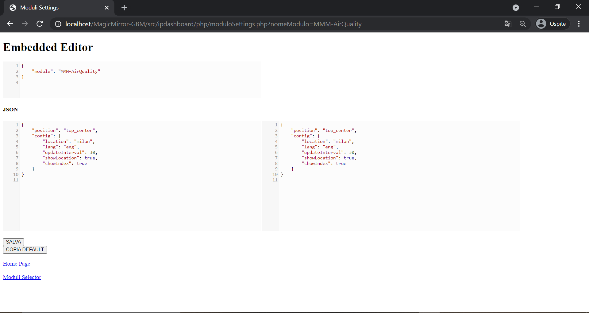
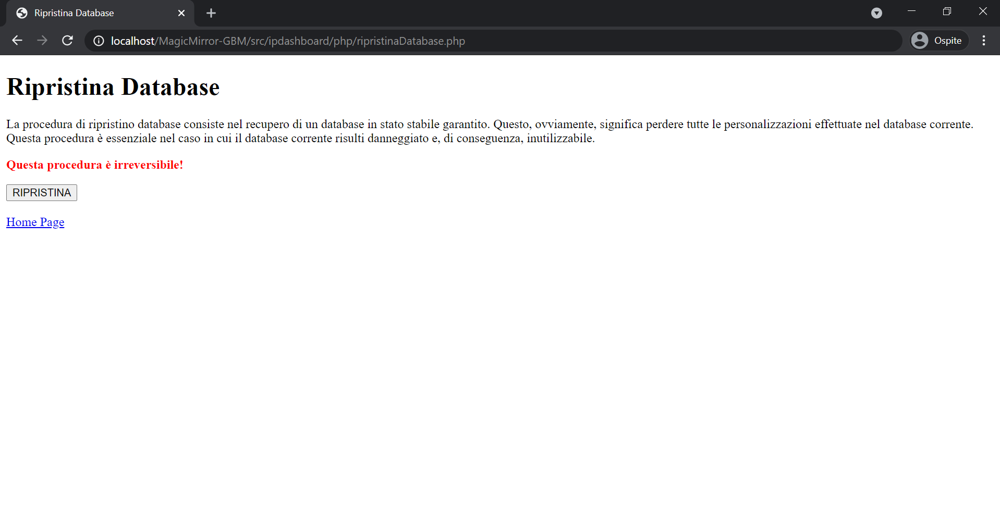

---
# Front matter of "classic" page

# Theme to use. Resides in the "_layouts" folder.
layout: default

# Page title. If omitted, the page will not be included in the navbar.
title: MagicMirror-GBM IP Dashboard

#################################################################

# Specifies the order of the current page from the point of view of the navbar. Can have repetition in the numbers, for parent-child hierarchies.
nav_order: 3

# Let exclude the page from the navbar
nav_exclude: false

# Let exclude the page from the built-in search engine
search_exclude: false

#################################################################

# Set "true" if this page has childrens, "false" otherwise.
has_children: false

# If this page is some page's child, specify the parent's name, otherwise comment out the option. If this page is some page's grandchild, specify grandparent's name, otherwise comment out the option.
parent: MagicMirror-GBM
# # grand_parent: NOME_PAGINA_NONNO__GENITORE_DEL_GENITORE

# If this page is a parent page, a Table Of Contents will be automatically generated containing all related child pages. Use the option below to disable this functionality. Should always be set to "false".
has_toc: false

#################################################################

# Specify the current language of this page
lang: it

# Specify all other available languages in which this page is available. If there's no other language in addition to "lang", comment out this option.
# # availableLanguages:
# #   - 
---

# MagicMirror-GBM IP Dashboard
{: .no_toc }

---

<!-- Table of contents -->

  

    Table of contents
  

  {: .text-delta }
1. TOC
{:toc}

---

Il MagicMirror-GBM può essere configurato grazie alla sua interfaccia web: `MagicMirror-GBM IP Dashboard`.
Essa mette a disposizione diversi strumenti per configurare diversi aspetti del MagicMirror-GBM.
Qui riportati e descritti:

> index.php

Home Page. Da qui puoi accedere le diverse funzionalità dell'interfaccia.

---

> MMM-MD-ContentEditor.php

Embedded editor MD. Qui puoi modificare il contenuto renderizzato e visualizzato dal modulo MMM-MD.
Qui per maggiori informazioni: [https://github.com/AndreaGrandieri/MMM-MD](https://github.com/AndreaGrandieri/MMM-MD)

---

> moduliSelector.php

Lista dei moduli presenti nel Database del MagicMirror-GBM.
Da qui puoi:

- Attivare / Disattivare modulo
- Cambiare ordine di render grafico del modulo
- Accedere all'embedded editor per modificare il frammento di configurazione del modulo

---

> moduloSettings.php

Embedded editor JSON. Qui puoi modificare il frammento JSON di configurazione del modulo selezionato. __E' raccomandato seguire le indicazioni riportate nei documenti dedicati [https://andreagrandieri.github.io/MagicMirror-GBM/#indice-moduli](https://andreagrandieri.github.io/MagicMirror-GBM/#indice-moduli)__

---

> WIFIConfigurator.php

Da qui puoi modificare le impostazioni relative alla configurazione della connettività WIFI (alla rete) per il MagicMirror-GBM. _Probabilmente ti troverai qui durante la fase di prime._

---

> AudioConfigurator.php

Da qui puoi modificare le impostazioni relative alla configurazione dei dispositivi di output audio per il MagicMirror-GBM.

---

> globalsSelector.php

Lista delle globali presenti nel Database del MagicMirror-GBM.
Da qui puoi:

- Accedere all'embedded editor per modificare il frammento di configurazione della globale

---

> globalSettings.php

Embedded editor JSON. Qui puoi modificare il frammento JSON di configurazione della globale selezionata. __E' sconsigliata la modifica di queste informazioni se non strettamente necessario.__

---

> aggiornamentoSoftware.php

Da qui puoi aggiornare il software del MagicMirror-GBM.

---

> doReboot.php

Riavvia il MagicMirror-GBM.

---

> ripristinaDatabase.php

Da qui puoi ripristinare il Database interno del MagicMirror-GBM ad uno stato stabile sicuramente funzionale e corretto.

---

> compila.php

Compila lo stato del Database, rendendo effettive le modifiche effettuate _(con le schermate precedenti)_.

