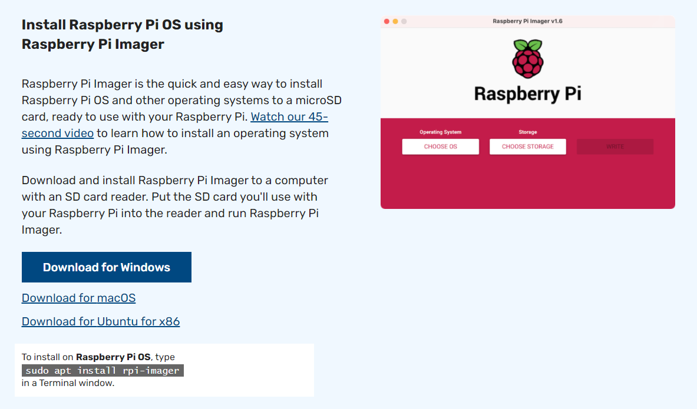
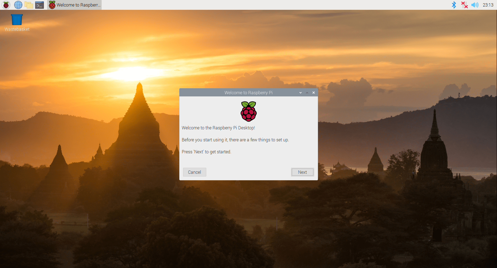
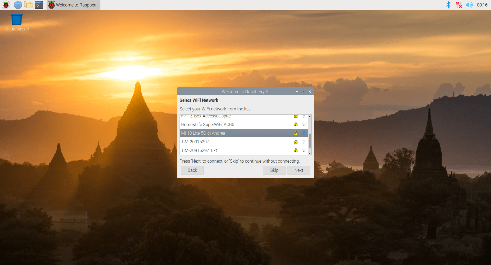
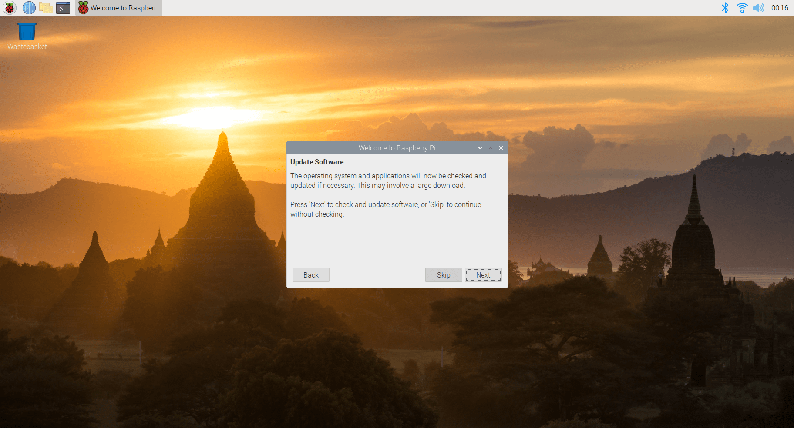
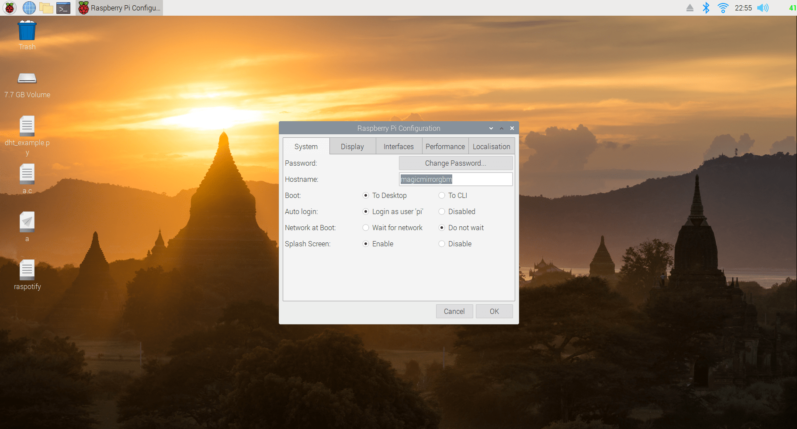

---
# Front matter of "classic" page

# Theme to use. Resides in the "_layouts" folder.
layout: default

# Page title. If omitted, the page will not be included in the navbar.
title: MagicMirror-GBM OS

#################################################################

# Specifies the order of the current page from the point of view of the navbar. Can have repetition in the numbers, for parent-child hierarchies.
nav_order: 1

# Let exclude the page from the navbar
nav_exclude: false

# Let exclude the page from the built-in search engine
search_exclude: false

#################################################################

# Set "true" if this page has childrens, "false" otherwise.
has_children: false

# If this page is some page's child, specify the parent's name, otherwise comment out the option. If this page is some page's grandchild, specify grandparent's name, otherwise comment out the option.
parent: MagicMirror-GBM
# # grand_parent: NOME_PAGINA_NONNO__GENITORE_DEL_GENITORE

# If this page is a parent page, a Table Of Contents will be automatically generated containing all related child pages. Use the option below to disable this functionality. Should always be set to "false".
has_toc: false

#################################################################

# Specify the current language of this page
lang: it

# Specify all other available languages in which this page is available. If there's no other language in addition to "lang", comment out this option.
# # availableLanguages:
# #   - 
---

# MagicMirror-GBM-OS
{: .no_toc }

---

<!-- Table of contents -->
<details open markdown="block">
  <summary>
    Table of contents
  </summary>
  {: .text-delta }
1. TOC
{:toc}
</details>

---

Il MagicMirror-GBM è reso funzionale dal suo sistema operativo: `MagicMirror-GBM-OS`.

- <i class="fa-solid fa-file-zipper fa-2x"></i> [MagicMirror-GBM-OS_v1.3.img.gz](https://api.onedrive.com/v1.0/shares/u!aHR0cHM6Ly8xZHJ2Lm1zL3UvcyFBbXN0V05uOEVrRXVoSnRPbFl2MlZrRTNMV3I0blE_ZT1YWDFoREM/root/content)

Puoi scrivere / flashare l'OS su una scheda SD pronta all'uso in un sistema Raspberry Pi usando
il software `Raspberry Pi Imager` ([https://www.raspberrypi.org/software/](https://www.raspberrypi.org/software/)).

[](../../assets/MagicMirror-OS/flash-using-raspberry-pi-imager.PNG)

---

## Specifiche

Ecco riportate le principali caratteristiche e requisiti essenziali:

- Distribuzione: `Raspberry Pi OS (32-bit)`
- Raspberry Pi: `3 o superiore`
- __nodejs: `v10.24.0`__
- __npm: `v5.8.0`__
- Storage Memory: `minimo (rischioso) 8GB; minimo consigliato: 16GB`
- RAM: `minimo 1GB`
- Nome Personale: `pi`
- Nome PC: `magicmirrorgbm`
- Nome utente: `pi`
- Password: `gbm`
- Internet configurations: _none_

---

## Costruzione

Di seguito riportati i passaggi per costruire il `MagicMirror-GBM-OS` partendo da una distribuzione `Raspberry Pi OS Full (32-bit)` grezza.
Parte delle seguenti istruzioni sono compatibili per costruire la `MagicMirror-GBM-Emulation-VM`. Esse sono indicate con: ___(+VM)___:

1. __SOLO__ ___(+VM)___: Installare tools vmware:

    ```shell
    sudo apt install open-vm-tools-desktop open-vm-tools
    ```

2. Soddisfare la fase guidata di setup iniziale di Raspberry:

    1. Next

        [](../../assets/MagicMirror-OS/default-rasp-guidedprime/1.png)

    2. Imposta località

        [](../../assets/MagicMirror-OS/default-rasp-guidedprime/2.png)

    3. Imposta password

        [](../../assets/MagicMirror-OS/default-rasp-guidedprime/3.png)

    4. Next

        [](../../assets/MagicMirror-OS/default-rasp-guidedprime/4.png)

    5. Seleziona rete WIFI / Cablata

        [](../../assets/MagicMirror-OS/default-rasp-guidedprime/5.png)

    6. __NON FARE L'AGGIORNAMENTO SOFTWARE__ (se lo fai, accertati di rispettare le versioni di `nodejs` e `npm` riportate nelle `Specifiche` sopra)

        [](../../assets/MagicMirror-OS/default-rasp-guidedprime/6.png)

    7. Puoi anche assegnare un nome personalizzato al dispositivo Raspberry (per essere individuato più facilmente nella rete)

        [](../../assets/MagicMirror-OS/default-rasp-guidedprime/7.png)

3. Disattivare spegnimento automatico schermo Raspberry:

    ```shell
    cd \

    # Accesso al file "autostart"
    sudo nano /etc/xdg/lxsession/LXDE-pi/autostart
    ```

    Appendere (in coda) al contenuto del file:

    ```plaintext
    @xset s off
    @xset -dpms
    ```

4. Installare `nodejs` ___(+VM)___:

    ```shell
    sudo apt install nodejs
    ```

5. Installare `npm` ___(+VM)___:

    ```shell
    sudo apt install npm
    ```

6. Installare `npm-recursive-install` ___(+VM)___:

    ```shell
    sudo npm i -g recursive-install
    ```

7. Installare `bcm2835`:

    ```shell
    wget http://www.airspayce.com/mikem/bcm2835/bcm2835-1.52.tar.gz
    tar zxvf bcm2835-1.52.tar.gz
    cd bcm2835-1.52
    ./configure
    make
    sudo make check
    sudo make install
    cd \
    ```

8. Installare `raspotify`:

    ```shell
    sudo curl -sL https://dtcooper.github.io/raspotify/install.sh | sh
    ```

9. __SOLO__ ___(+VM)___: Installare `git`:

    ```shell
    sudo apt install git
    ```

10. Clonare repo `AndreaGrandieri/MagicMirror-GBM` nella dir `~` ___(+VM)___:

    ```shell
    git clone https://www.github.com/AndreaGrandieri/MagicMirror-GBM
    ```

    Effettuare il checkout alla release (versione) desiderata:

    ```shell
    cd MagicMirror-GBM/
    git checkout v.X.X -b v.X.X
    ```

11. Installare `electron` ___(+VM)___:

    ```shell
    cd src/

    npm install electron --save-dev
    cd \
    ```

12. Installazione LAMP (Linux, Apache, MySQL, PHP) ___(+VM)___:

    ```shell
    sudo apt install apache2
    sudo apt install mariadb-server
    sudo mysql_secure_installation
    ```

    mysql_secure_installation:

    ```plaintext
    Enter current password for root (enter for none): gbm
    Change the root password?: n
    Remove anonymous users: n
    Disallow root login remotely: n
    Remove test database and access to it: y
    Reload privilegies table now: y
    ```

    ```shell
    sudo apt install php libapache2-mod-php php-mysql
    ```

    Modifica della root di serving per Apache e rilascio consensi

    ```shell
    cd /etc/apache2/sites-available

    # Accesso al file "000-default.conf"
    sudo nano 000-default.conf
    ```

    Modificare l'opzione `DocumentRoot` nel file:

    ```conf
    DocumentRoot /home/pi/MagicMirror-GBM/src/ipdashboard
    ```

    Rilascio consensi:

    ```shell
    cd \
    cd /etc/apache2

    # Accesso al file "apache2.conf"
    sudo nano apache2.conf
    ```

    Modificare l'opzione `<Directory /></Directory>` nel file (dovrebbe trovarsi alla riga ___153___):

    ```conf
    <Directory />
        Options Indexes FollowSymLinks Includes ExecCGI
        AllowOverride All
        Require all granted
    </Directory>
    ```

    Installazione di sqlite:

    ```shell
    cd \
    sudo apt-get install php-sqlite3
    ```

    Riavviare il servizio `apache2`:

    ```shell
    sudo service apache2 restart
    ```

13. Modifica dei `sudoers`, in modo tale da permettere l'interfaccia IP l'esecuzione di
    alcuni comandi che richiedono privilegi di admin ___(+VM)___:

    ```shell
    # Accesso al file: "sudoers"
    sudo visudo
    ```

    Appendere (in coda) al contenuto del file:

    ```plaintext
    www-data ALL = NOPASSWD: /sbin/reboot, /sbin/halt
    ```

14. Fornisco permessi di scrittura file protetti all'interfaccia IP ___(+VM)___:

    ```shell
    sudo chown -R www-data:www-data /etc/default/raspotify
    sudo chmod -R g+w /etc/default/raspotify

    sudo chown -R www-data:www-data /etc/pulse/default.pa
    sudo chmod -R g+w /etc/pulse/default.pa

    sudo chown -R www-data:www-data /etc/wpa_supplicant/wpa_supplicant.conf
    sudo chmod -R g+w /etc/wpa_supplicant/wpa_supplicant.conf

    sudo chown -R www-data:www-data /home/pi/MagicMirror-GBM/src/ipdashboard/
    
    sudo chown -R www-data:www-data /home/pi/MagicMirror-GBM/src/config/config.js

    sudo chown -R www-data:www-data /home/pi/MagicMirror-GBM/src/modules/MMM-MD/public/content.md
    sudo chmod -R g+w /home/pi/MagicMirror-GBM/src/modules/MMM-MD/public/content.md
    ```

15. Imposto dispositivo di default per output audio (OS + Raspotify) + configurazione denominazione cast service per Raspotify:
    [https://github.com/AndreaGrandieri/MagicMirror-GBM/issues/76#issuecomment-827711074](https://github.com/AndreaGrandieri/MagicMirror-GBM/issues/76#issuecomment-827711074)
    [https://github.com/AndreaGrandieri/MagicMirror-GBM/issues/228#issuecomment-828311332](https://github.com/AndreaGrandieri/MagicMirror-GBM/issues/228#issuecomment-828311332)

    ```shell
    # Accesso al file "raspotify" (riferimenti utili: https://github.com/AndreaGrandieri/MagicMirror-GBM/issues/76#issuecomment-827711074)
    sudo nano /etc/default/raspotify
    ```

    Modificare l'opzione `DEVICE_NAME` nel file:

    ```plaintext
    DEVICE_NAME="MagicMirror-GBM-spotify-cast"
    ```

    Modifica l'opzione `OPTIONS` nel file:

    ```plaintext
    OPTIONS="--device hw:1"
    ```

    ```shell
    # Accesso al file "default.pa" (riferimenti utili: https://github.com/AndreaGrandieri/MagicMirror-GBM/issues/228#issuecomment-828311332)
    sudo nano /etc/pulse/default.pa
    ```

    Modifica l'opzione `set-default-sink` nel file:

    `set-default-sink alsa_output.platform-bcm2835_audio.analog-stereo`

16. Riavviare il Raspberry ___(+VM)___:

    ```shell
    sudo shutdown -r now
    ```

17. Eseguire installazione ricorsiva nella dir `~/MagicMirror-GBM/src` con checkout del branch `main` ___(+VM)___:

    ```shell
    cd MagicMirror-GBM/src/    

    npm-recursive-install
    ```

18. Impostare avvio automatico del servizio:

    ```shell
    sudo nano /etc/xdg/lxsession/LXDE-pi/autostart
    @npm run start --prefix /home/pi/MagicMirror-GBM/src/
    ```

19. Rimozione informazioni personali (WIFI (SSID + password))

    Cancellare tutto il contenuto del seguente file:

    ```shell
    sudo nano /etc/wpa_supplicant/wpa_supplicant.conf
    ```
