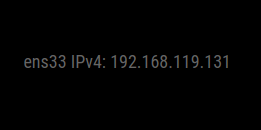

# MMM-ip

## tl;dr

Visualizza gli indirizzi IP __locali__ delle interfacce di rete attive nel __Raspberry Pi__.

---

## config.js fragment

```js
{
    module: 'MMM-ip',
    position: 'bottom_right',
    config: {
        fontSize: 9,
        families: [
            "IPv4"
        ],
        types: [

        ]
    }
}
```

---

## Proprietà (config section)

| Proprietà  | Tipo                | Valori                                                                                          | Valore Default | Inderogabilità | Descrizione                                                                                 |
| ---------- | ------------------- | ----------------------------------------------------------------------------------------------- | -------------- | -------------- | ------------------------------------------------------------------------------------------- |
| `fontSize` | `Integer`           | Qualsiasi valore `> 0`. Unità di misura: `pixel`.                                               | `9`            | `OPTIONAL`     | Dimensione in pixel del font per la visualizzazione degli elementi renderizzati dal modulo. |
| `families` | `Array` -> `String` | `"IPv4"`: Visualizza indirizzi IPv4. <br> `IPv6`: Visualizza indirizzi IPv6 .                   | `---`          | `REQUIRED`     | Tipologia / Tipologie di indirizzi IP da visualizzare.                                      |
| `types`    | `Array` -> `String` | Nome interfaccia / interfacce di rete da monitorare. _Guarda sotto per ulteriori informazioni_. | `---`          | `REQUIRED`     | Interfaccia / Interfacce di rete da monitorare.                                             |

---

## Screenshots

Schermata del modulo in esecuzione correttamente:



---

## Interfaccia di Rete

Solitamente le interfacce di rete di default per un __Raspberry Pi__ in
_situazione normale_ (cioè senza modifiche alle impostazioni di default dell'OS)
sono le seguenti:

- Ethernet: `eth0`
- WIFI: `wlan0`

Questi sono i comandi per ottenere informazioni sulle interfacce di rete del
proprio __Raspberry Pi__:

```shell

```
