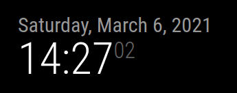

# Clock

## tl;dr

Il seguente modulo mostra la data e l'ora correnti.

---

## config.js fragment

```js
{
    module: "clock",
    // you may choose any location
    position: "top_left",
    config: {
        timeFormat: 24,
        displaySeconds: true,
        showDate: true,
        displayType: 'digital',
        timezone: 'Europe/Rome',
    }
}
```

---

## Proprietà (config section)

| Proprietà        | Tipo                                               | Valori                                                                             | Valore Default          | Inderogabilità           | Descrizione              |
| ---------------- | -------------------------------------------------- | ---------------------------------------------------------------------------------- | ----------------------- | ------------------------ | ------------------------ |
| `timeFormat` | `Number` | `12` o `24`. | _`config.timeFormat`_ | `OPTIONAL` | Formato dell'ora (12 o 24 ore) |
| `displaySeconds` | `Boolean` | `true`: visualizzazione secondi attivato. <br> `false`: visualizzazione secondi disattivato.  | `true` | `OPTIONAL` | Attiva / disattiva visualizzazione secondi. |
| `showDate` | `Booleran` | `true`: visualizzazione data attivato. <br> `false`: visualizzazione data disattivato. | `true` | `OPTIONAL` | Attiva / disattiva visualizzazione data. |
| `displayType` | `String` | `digital`, `analog` o `both`. | `digital` | `OPTIONAL` | Visualizzazione orario come orologio analogico, digitale o entrambi |
| `timezone` | `String` | Qui puoi trovare / cercare tutte le possibili zone: https://momentjs.com/timezone/. | `---` | `REQUIRED` | Zona di cui mostrare l'ora |

---

## Screenshots

Questa è la visualizzazione del modulo in situazione di funzionamento corretto:



---
